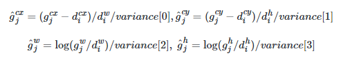
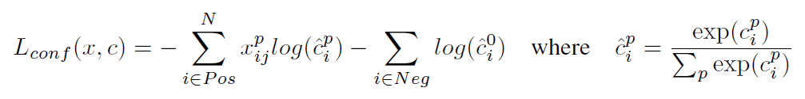

### SSD（2016）

- 多个特征层进行预测，在不同特征尺度上预测不同尺度的目标；检测小目标性能变优：高层语义信息多而细节信息少，低层则相反。
- 使用VGG16为bakcbone，输入大小为300x300。一共有6个特征层，在第一层检测较小的目标，而随着层的增多，抽象能力增强则会检测稍大的目标。
- 使用了default box（提前设定），类似anchor box。每层对应的default box数分别为4，6，6，6，4，4，其中包括不同大小。
- default box的比例设置前面一个特征层和后面两个特征层使用4个default box。因为很大以及很小的目标占少数而中等大小目标占大多数。
- 与YOLOv1不同，采用了卷积层代替全连接层。
- 在SSD中通过计算anchor和ground truth box的IOU来确定哪个anchor负责哪个物体，而不是像YOLOv1一样通过物体的中心点来确定，这样就能更好的预测那些重叠或近邻的物体。
- 每个特征层上的点，预测(c+4)xk，k为k个default box，c为加上背景的类别总数，4为坐标（xywh）。
- 损失函数：类别损失+定位损失

### 前言

目标检测近年来已经取得了很重要的进展，主流的算法主要分为两个类型（参考RefineDet）：

1.two-stage方法，如R-CNN系算法，其主要思路是先通过启发式方法（selective search）或者CNN网络（RPN)产生一系列稀疏的候选框，然后对这些候选框进行分类与回归，two-stage方法的优势是准确度高；

2.one-stage方法，如YOLO和SSD，其主要思路是均匀地在图片的不同位置进行密集抽样，抽样时可以采用不同尺度和长宽比，然后利用CNN提取特征后直接进行分类与回归，整个过程只需要一步，所以其优势是速度快，但是均匀的密集采样的一个重要缺点是训练比较困难，这主要是因为正样本与负样本（背景）极其不均衡（参见Focal Loss），导致模型准确度稍低。不同算法的性能如图1所示，可以看到两类方法在准确度和速度上的差异。


SSD算法英文全名是Single Shot MultiBox Detector，Single shot指明了SSD算法属于one-stage方法，MultiBox指明了SSD是多框预测。

相比YOLO，SSD采用CNN来直接进行检测，而不是像YOLO那样在全连接层之后做检测。其实采用卷积直接做检测只是SSD相比YOLO的其中一个不同点，另外还有两个重要的改变，一是SSD提取了不同尺度的特征图来做检测，大尺度特征图（较靠前的特征图）可以用来检测小物体，而小尺度特征图（较靠后的特征图）用来检测大物体；二是SSD采用了不同尺度和长宽比的先验框（Prior boxes, Default boxes，在Faster R-CNN中叫做锚，Anchors）。

YOLO算法缺点是难以检测小目标，而且定位不准，但是这几点重要改进使得SSD在一定程度上克服这些缺点。


### 设计理念

SSD和YOLO一样都是采用一个CNN网络来进行检测，但是却采用了多尺度的特征图，其基本架构如图3所示。下面将SSD核心设计理念总结为以下三点：


**（1）采用多尺度特征图用于检测**

所谓多尺度采用大小不同的特征图，CNN网络一般前面的特征图比较大，后面会逐渐采用stride=2的卷积或者pool来降低特征图大小，这正如图3所示，一个比较大的特征图和一个比较小的特征图，它们都用来做检测。这样做的好处是比较大的特征图来用来检测相对较小的目标，而小的特征图负责检测大目标，如图4所示，8x8的特征图可以划分更多的单元，但是其每个单元的先验框尺度比较小。


**（2）采用卷积进行检测**

与YOLO最后采用全连接层不同，SSD直接采用卷积对不同的特征图来进行提取检测结果。对于形状为m×n×p的特征图，只需要采用3×3×p这样比较小的卷积核得到检测值。

**（3）设置先验框**

在YOLO中，每个单元预测多个边界框，但是其都是相对这个单元本身（正方块），但是真实目标的形状是多变的，YOLO需要在训练过程中自适应目标的形状。而SSD借鉴了Faster R-CNN中anchor的理念，每个单元设置尺度或者长宽比不同的先验框，预测的边界框（bounding boxes）是以这些先验框为基准的，在一定程度上减少训练难度。一般情况下，每个单元会设置多个先验框，其尺度和长宽比存在差异，如图5所示，可以看到每个单元使用了4个不同的先验框，图片中猫和狗分别采用最适合它们形状的先验框来进行训练，后面会详细讲解训练过程中的先验框匹配原则。


SSD的检测值也与YOLO不太一样。对于每个单元的每个先验框，其都输出一套独立的检测值，对应一个边界框，主要分为两个部分。第一部分是各个类别的置信度或者评分，值得注意的是SSD将背景也当做了一个特殊的类别，如果检测目标共有c个类别，SSD其实需要预测c+1个置信度值，其中第一个置信度指的是不含目标或者属于背景的评分。后面当我们说c个类别置信度时，请记住里面包含背景那个特殊的类别，即真实的检测类别只有c−1个。

在预测过程中，置信度最高的那个类别就是边界框所属的类别，特别地，当第一个置信度值最高时，表示边界框中并不包含目标。第二部分就是边界框的location，包含4个值，分别表示边界框的中心坐标以及宽高。但是真实预测值其实只是边界框相对于先验框的转换值(paper里面说是offset，但是觉得transformation更合适，参见[R-CNN](https://link.zhihu.com/?target=https%3A//arxiv.org/abs/1311.2524))。先验框位置用d=(dcx,dcy,dw,dh)表示，其对应边界框用b=(bcx,bcy,bw,bh)表示，那么边界框的预测值l其实是b相对于d的转换值：

lcx=(bcx−dcx)/dw, lcy=(bcy−dcy)/dh

lw=log⁡(bw/dw), lh=log⁡(bh/dh)

习惯上，我们称上面这个过程为边界框的编码（encode），预测时，你需要反向这个过程，即进行解码（decode），从预测值l中得到边界框的真实位置b：

bcx=dwlcx+dcx, bcy=dylcy+dcy

bw=dwexp⁡(lw), bh=dhexp⁡(lh)

然而，在SSD的Caffe源码实现中还有trick，那就是设置variance超参数来调整检测值，通过bool参数variance_encoded_in_target来控制两种模式，当其为True时，表示variance被包含在预测值中，就是上面那种情况。但是如果是False（大部分采用这种方式，训练更容易？），就需要手动设置超参数variance，用来对 l 的4个值进行放缩，此时边界框需要这样解码：

$$
b^{cx}=d^w (variance[0]*l^{cx}) + d^{cx}, \space b^{cy}=d^y (variance[1]*l^{cy}) + d^{cy}
$$


$$
b^{w}=d^w \exp(variance[2]*l^{w}), \space b^{h}=d^h \exp(variance[3]*l^{h})
$$

综上所述，对于一个大小m×n的特征图，共有mn个单元，每个单元设置的先验框数目记为k，那么每个单元共需要k个预测值，所有的单元共需要 kmn个预测值，由于SSD采用卷积做检测，所以就需要(c+4)k个卷积核完成这个特征图的检测过程。

### 网络结构

SSD采用VGG16作为基础模型，然后在VGG16的基础上新增了卷积层来获得更多的特征图以用于检测。SSD的网络结构如图5所示。上面是SSD模型，下面是YOLO模型，可以明显看到SSD利用了多尺度的特征图做检测。模型的输入图片大小是300×300，还可以是512×512，其与前者网络结构没有差别，只是最后新增一个卷积层。


采用VGG16做基础模型，首先VGG16是在ILSVRC CLS-LOC数据集预训练。然后借鉴了DeepLab-LargeFOV，分别将VGG16的全连接层fc6和fc7转换成 3×3 卷积层 conv6和 1×1 卷积层conv7，同时将池化层pool5由原来的stride=2的 2×2 变成stride=1的 3×3 （猜想是不想reduce特征图大小），为了配合这种变化，采用了一种Atrous Algorithm，其实就是conv6采用扩展卷积或带孔卷积（Dilation Conv），其在不增加参数与模型复杂度的条件下指数级扩大卷积的视野，其使用扩张率(dilation rate)参数，来表示扩张的大小。

如下图6所示，(a)是普通的 3×3 卷积，其视野就是 3×3 ，(b)是扩张率为2，此时视野变成 7×7 ，(c)扩张率为4时，视野扩大为 15×15 ，但是视野的特征更稀疏了。Conv6采用 3×3 大小但dilation rate=6的扩展卷积。


然后移除dropout层和fc8层，并新增一系列卷积层，在检测数据集上做finetuing。

其中VGG16中的Conv4_3层将作为用于检测的第一个特征图。conv4_3层特征图大小是 38×38 ，但是该层比较靠前，其norm较大，所以在其后面增加了一个L2 Normalization层（参见ParseNet），以保证和后面的检测层差异不是很大，这个和Batch Normalization层不太一样，其仅仅是对每个像素点在channle维度做归一化，而Batch Normalization层是在[batch_size, width, height]三个维度上做归一化。归一化后一般设置一个可训练的放缩变量gamma，使用TF可以这样简单实现：

```python
# l2norm (not bacth norm, spatial normalization)
def l2norm(x, scale, trainable=True, scope="L2Normalization"):
    n_channels = x.get_shape().as_list()[-1]
    l2_norm = tf.nn.l2_normalize(x, [3], epsilon=1e-12)
    with tf.variable_scope(scope):
        gamma = tf.get_variable("gamma", shape=[n_channels, ], dtype=tf.float32,
                                initializer=tf.constant_initializer(scale),
                                trainable=trainable)
        return l2_norm gamma
```

从后面新增的卷积层中提取Conv7，Conv8_2，Conv9_2，Conv10_2，Conv11_2作为检测所用的特征图，加上Conv4_3层，共提取了6个特征图，其大小分别是 (38,38),(19,19),(10,10),(5,5),(3,3),(1,1) ，但是不同特征图设置的先验框数目不同（同一个特征图上每个单元设置的先验框是相同的，这里的数目指的是一个单元的先验框数目）。先验框的设置，包括尺度（或者说大小）和长宽比两个方面。对于先验框的尺度，其遵守一个线性递增规则：随着特征图大小降低，先验框尺度线性增加：

$$
s*k = s*{min} + \frac{s*{max} - s*{min}}{m-1}(k-1), k\in[1,m]
$$

其中 m 指的特征图个数，但却是 5 ，因为第一层（Conv4_3层）是单独设置的， $s*k表示先验框大小相对于图片的比例，而表示先验框大小相对于图片的比例，而s*{min}和和s*{max}表示比例的最小值与最大值，paper里面取0.2和0.9。对于第一个特征图，其先验框的尺度比例一般设置为表示比例的最小值与最大值，paper里面取0.2和0.9。对于第一个特征图，其先验框的尺度比例一般设置为s*{min}/2=0.1，那么尺度为，那么尺度为300\times 0.1=30。对于后面的特征图，先验框尺度按照上面公式线性增加，但是先将尺度比例先扩大100倍，此时增长步长为。对于后面的特征图，先验框尺度按照上面公式线性增加，但是先将尺度比例先扩大100倍，此时增长步长为\lfloor \frac{\lfloor s*{max}\times 100\rfloor - \lfloor s*{min}\times 100\rfloor}{m-1}\rfloor=17，这样各个特征图的，这样各个特征图的s_k为为20, 37, 54, 71, 88，将这些比例除以100，然后再乘以图片大小，可以得到各个特征图的尺度为，将这些比例除以100，然后再乘以图片大小，可以得到各个特征图的尺度为60,111, 162,213,264，这种计算方式是参考SSD的Caffe源码。综上，可以得到各个特征图的先验框尺度，这种计算方式是参考SSD的Caffe源码。综上，可以得到各个特征图的先验框尺度30,60,111, 162,213,264。对于长宽比，一般选取。对于长宽比，一般选取a_r\in {1,2,3,\frac{1}{2},\frac{1}{3}}，对于特定的长宽比，按如下公式计算先验框的宽度与高度（后面的，对于特定的长宽比，按如下公式计算先验框的宽度与高度（后面的s_k$ 均指的是先验框实际尺度，而不是尺度比例）：
$$
w^a_{k}=s_k\sqrt{a*r},\space h^a*{k}=s_k/\sqrt{a_r}
$$
默认情况下，每个特征图会有一个 ar=1 且尺度为 $s*k的先验框，除此之外，还会设置一个尺度为的先验框，除此之外，还会设置一个尺度为s'*{k}=\sqrt{s*k s*{k+1}}且且a*r=1的先验框，这样每个特征图都设置了两个长宽比为1但大小不同的正方形先验框。注意最后一个特征图需要参考一个虚拟的先验框，这样每个特征图都设置了两个长宽比为1但大小不同的正方形先验框。注意最后一个特征图需要参考一个虚拟s*{m+1}=300\times105/100=315来计算来计算s'_{m}。因此，每个特征图一共有。因此，每个特征图一共有6个先验框个先验框{1,2,3,\frac{1}{2},\frac{1}{3},1'}，但是在实现时，Conv43，Conv102和Conv112层仅使用4个先验框，它们不使用长宽比为，但是在实现时，Conv43，Conv102和Conv112层仅使用4个先验框，它们不使用长宽比为3,\frac{1}{3}的先验框。每个单元的先验框的中心点分布在各个单元的中心，即的先验框。每个单元的先验框的中心点分布在各个单元的中心，即(\frac{i+0.5}{|f_k|},\frac{j+0.5}{|f_k|}),i,j\in[0, |f_k|)，其中，其中|f_k|$ 为特征图的大小。

得到了特征图之后，需要对特征图进行卷积得到检测结果，图7给出了一个 5×5大小的特征图的检测过程。其中Priorbox是得到先验框，前面已经介绍了生成规则。检测值包含两个部分：类别置信度和边界框位置，各采用一次 3×3卷积来进行完成。令 nk为该特征图所采用的先验框数目，那么类别置信度需要的卷积核数量为 nk×c，而边界框位置需要的卷积核数量为 nk×4。由于每个先验框都会预测一个边界框，所以SSD300一共可以预测 38×38×4+19×19×6+10×10×6+5×5×6+3×3×4+1×1×4=8732 个边界框，这是一个相当庞大的数字，所以说SSD本质上是密集采样。


### 训练过程

**（1）先验框匹配**
在训练过程中，首先要确定训练图片中的ground truth（真实目标）与哪个先验框来进行匹配，与之匹配的先验框所对应的边界框将负责预测它。在YOLO中，ground truth的中心落在哪个单元格，该单元格中与其IOU最大的边界框负责预测它。但是在SSD中却完全不一样，SSD的先验框与ground truth的匹配原则主要有两点。首先，对于图片中每个ground truth，找到与其IOU最大的先验框，该先验框与其匹配，这样，可以保证每个ground truth一定与某个先验框匹配。通常称与ground truth匹配的先验框为正样本（其实应该是先验框对应的预测box，不过由于是一一对应的就这样称呼了），反之，若一个先验框没有与任何ground truth进行匹配，那么该先验框只能与背景匹配，就是负样本。

一个图片中ground truth是非常少的， 而先验框却很多，如果仅按第一个原则匹配，很多先验框会是负样本，正负样本极其不平衡，所以需要第二个原则。

第一个原则是：对于剩余的未匹配先验框，若某个ground truth的 IOU 大于某个阈值（一般是0.5），那么该先验框也与这个ground truth进行匹配。这意味着某个ground truth可能与多个先验框匹配，这是可以的。但是反过来却不可以，因为一个先验框只能匹配一个ground truth，如果多个ground truth与某个先验框 IOU 大于阈值，那么先验框只与IOU最大的那个ground truth进行匹配。

第二个原则一定在第一个原则之后进行，仔细考虑一下这种情况，如果某个ground truth所对应最大 IOU 小于阈值，并且所匹配的先验框却与另外一个ground truth的 IOU 大于阈值，那么该先验框应该匹配谁，答案应该是前者，首先要确保某个ground truth一定有一个先验框与之匹配。但是，这种情况我觉得基本上是不存在的。由于先验框很多，某个ground truth的最大 IOU 肯定大于阈值，所以可能只实施第二个原则既可以了，这里的[TensorFlow版本](https://link.zhihu.com/?target=https%3A//github.com/xiaohu2015/SSD-Tensorflow/blob/master/nets/ssd_common.py)就是只实施了第二个原则，但是这里的[Pytorch](https://link.zhihu.com/?target=https%3A//github.com/amdegroot/ssd.pytorch/blob/master/layers/box_utils.py)两个原则都实施了。图8为一个匹配示意图，其中绿色的GT是ground truth，红色为先验框，FP表示负样本，TP表示正样本。


尽管一个ground truth可以与多个先验框匹配，但是ground truth相对先验框还是太少了，所以负样本相对正样本会很多。为了保证正负样本尽量平衡，SSD采用了hard negative mining，就是对负样本进行抽样，抽样时按照置信度误差（预测背景的置信度越小，误差越大）进行降序排列，选取误差的较大的top-k作为训练的负样本，以保证正负样本比例接近1:3。

**（2）损失函数**
训练样本确定了，然后就是损失函数了。损失函数定义为位置误差（locatization loss， loc）与置信度误差（confidence loss, conf）的加权和：

$$
L(x, c, l, g) = \frac{1}{N}(L*{conf}(x,c) + \alpha L*{loc}(x,l,g))
$$

其中 N 是先验框的正样本数量。这里 $x^p*{ij}\in { 1,0 }\ 为一个指示参数，当\*x^p*{ij}= 1 时表示第*i 个先验框与第*j 个groundtruth匹配，并且groundtruth的类别为*p 。*c 为类别置信度预测值。*l 为先验框的所对应边界框的位置预测值，而*g$ 是ground truth的位置参数。对于位置误差，其采用Smooth L1 loss，定义如下：


由于 xijp 的存在，所以位置误差仅针对正样本进行计算。值得注意的是，要先对ground truth的 g 进行编码得到 g^ ，因为预测值 l 也是编码值，若设置variance_encoded_in_target=True，编码时要加上variance：



对于置信度误差，其采用softmax loss:



权重系数 α 通过交叉验证设置为1。

**（3）数据扩增**

采用数据扩增（Data Augmentation）可以提升SSD的性能，主要采用的技术有水平翻转（horizontal flip），随机裁剪加颜色扭曲（random crop \& color distortion），随机采集块域（Randomly sample a patch）（获取小目标训练样本），如下图所示：


### 预测过程

预测过程比较简单，对于每个预测框，首先根据类别置信度确定其类别（置信度最大者）与置信度值，并过滤掉属于背景的预测框。然后根据置信度阈值（如0.5）过滤掉阈值较低的预测框。对于留下的预测框进行解码，根据先验框得到其真实的位置参数（解码后一般还需要做clip，防止预测框位置超出图片）。解码之后，一般需要根据置信度进行降序排列，然后仅保留top-k（如400）个预测框。最后就是进行NMS算法，过滤掉那些重叠度较大的预测框。最后剩余的预测框就是检测结果了。

### 性能评估

文章还对SSD的各个trick做了更为细致的分析，表3为不同的trick组合对SSD的性能影响，从表中可以得出如下结论：

- 数据扩增技术很重要，对于mAP的提升很大；
- 使用不同长宽比的先验框可以得到更好的结果；
- 采用多尺度的特征图用于检测也是至关重要的;

### 小结

SSD在YOLO的基础上主要改进了三点：多尺度特征图，利用卷积进行检测，设置先验框。这使得SSD在准确度上比YOLO更好，而且对于小目标检测效果也相对好一点。

