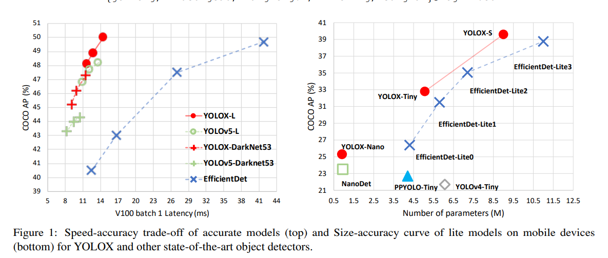
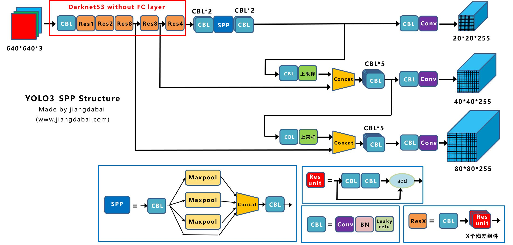

# YOLOX

## 网络结构：

这里使用了YOLOv3作为baseline，不过这里是采用YOLOv3-SPP，也就是DarkNet53+SPP层。使用了SPP Bottleneck的目的是将不同尺度的特征图缩放成固定大小，方便后面处理。输出了Dark3、Dark4、Dark5三个特征层用于后面的neck部分，加强特征的提取。并且训练的策略采用了：EMA权值更新、cosine学习率机制策略。

在neck的部分，是使用YOLO PA-FPN加强特征的提取。FPN是Feature pyramid network，特征金字塔网络；PAN是Path Aggregation network，路径聚合网络。Path Aggregation Network (PANet)实际是对Mask RCNN上进行做多处改进，来加强特征融合，比如引入bottom-up path augmentation结构，充分利用网络浅特征进行分割，防止经过多层的传递之后，浅层的特征信息丢失严重。以及adaptive feature pooling使得提取到的ROI特征更加丰富。PANet最后引入了fully-connected fusion。这是对原有的分割支路(FCN)引入一个前景二分类的全连接支路，通过融合一个前背景二分类支路的输出得到更加精确的分割结果。整体而言对于目标检测和分割系列算法有不少启发。

到了head部分，就是进行解耦操作，分开了回归与分类的过程。作者研究发现，将分类和回归耦合在一起时会影响性能。不仅加慢收敛的速度，也会提高检测头的复杂程度。但是这里使用了解耦头，会增加运算的复杂度。所以作者为了权衡速度与精度，最终使用了1个1x1 的卷积先进行降维，并在后面两个分支里，各使用了 2个3x3 卷积，最终调整到仅仅增加一点点的网络参数。

这里的backbone和neck中的激活函数都是使用SiLU函数。

## 数据增强
这里着重使用了mix-up与mosaic进行数据增强。

mosaic数据增强对四张图片进行不同形式的处理与拼接，并且每一张图片都有其对应的区域面积，将四张图片进行拼接后就获得了一张新的图片，
这样就相当于一下子传入了四张图片给网络了，这样也极大丰富了检测物体的背景，并且在标准化BN计算的时候也会同时计算四张图片的数据。

mixup就是将两张图进行不同权重的分配，最后叠加起来，有点重影的感觉在里头。当时主要应用在图像分类任务中，可以在几乎无额外计算开销的情况下，稳定提升1个百分点的分类精度。

注意的是：

1. 在训练的最后15个epoch，这两个数据增强会被关闭掉。
2. 由于采取了更强的数据增强方式，所以ImageNet预训练将毫无意义，因此，所有的模型，均是从头开始训练的。
3. 添加了RandomHorizontalFlip、ColorJitter以及多尺度数据增广，移除了RandomResizedCrop。

以及，合适的数据增广策略也需要根据模型的大小进行调整：MixUp可以帮助YOLOX-L取得0.9%AP指标提升，但会弱化YOLOX-Nano的性能。基于上述对比，当训练小模型时，我们移除MixUp，并弱化Mosaic增广，模型性能可以从24.0%提升到25.3%。而对于大模型则采用默认配置。

## Anchor-free

传统的目标检测都是基于anchor的，使用anchor存在几个问题：1.需要在训练之前进行聚类分析以确定最佳anchor集合，但是这些anchor集合存在数据相关性，泛化性能较差；2. anchor机制提升了检测头的复杂度。

如今，anchor-free的使用越来越广泛，在anchor-free的模型下：将每个位置的预测从3下降为1并直接预测四个值：即两个offset以及高宽。42.9%AP。

## Multi positives与SimOTA

我们知道检测模型推理的过程中会出现正负样本不均衡的现象，所以就需要进行正负样本的平均。传统的anchor-free版本仅仅对每个目标赋予一个正样本，而忽视了其他高质量预测。因此这里为每个中心点赋予了多个正样本。并且为每个gt分配不同数量的anchor。所用的策略是参考FCOS，赋予中心3×3区域为正样本。落入其中区域的都为正样本。

SimOTA实际就是为各个gt框进行anchor的分配。分配策略可以理解为，根据不同anchor的模糊程度赋予不同的权重，从而得到分配的数量。因为在OTA中，将模糊的anchor分配给任何gt或背景都会对其他gt的梯度造成不利影响。所以，对模糊anchor样本的分配策略是特殊的。为此，需要进行更优的分配策略：除了考虑分类信息，还考虑了位置信息。也就是为图像中的所有gt对象找到全局的高置信度进行分配。

但是这里又引入了一个问题：最优运输问题优化会带来25%的额外训练耗时。所以作者又简化为动态的top-k策略进行分配，也就是得到一个近似解：SimOTA。SimOTA的引入可以将模型的性能从45.0%提升到47.3%，大幅超越U版YOLOv的44.3%。

## 损失函数
定位损失（bboxes_preds）是用来iou或者giou损失，两者选其一；
前景背景损失（objpreds）和类别损失（cls_preds）则是采用BCE_loss。obj_preds因为是目标分数，所以维度是[1000，1]；cls_preds因为是类别分数，所以维度是[1000，2]。

这里的iou_loss和cls_loss，只针对目标框和筛选出的正样本预测框进行计算。而obj_loss，则还是针对8400个预测框。

### 其他backbone以及轻量级的测试

与Yolov5s、Yolov5m、Yolov5l、Yolov5x的进行比较：

Tiny and Nano 检测器：

