### LeNet（1998）

- LeNet 是最简单的 CNN 网络也是CNN的开创者
- LeNet-5 是 LeNet 系列最新的卷积神经网络，设计用于识别机器打印的字符

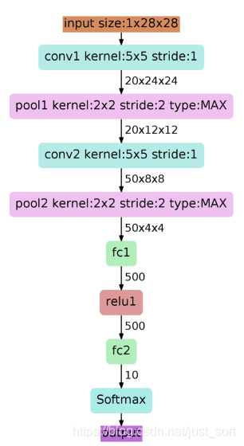

### AlexNet（2012）

- 2012年第一次在比赛中使用，并超过第二名10.9个百分点
- 在全连接层的前两层（一共三个）使用了Dropout
- 使用LRN，局部响应归一化：对局部神经元的活动创建竞争机制，使得其中响应比较大的值变得相对更大，并抑制其他反馈较小的神经元，增强了模型的泛化能力。同时归一化可以加速收敛
- 使用了更深的网络，一共包含5个卷积层和3个全连接层

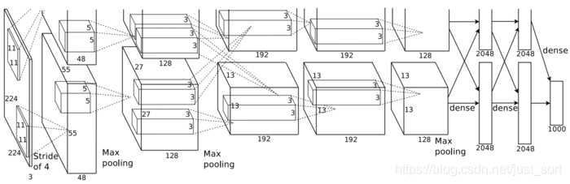

- 用了两个分支，因为当时GPU的显存不够，在最后的全连接层进行了特征融合，这也是第一次使用GPU进行网络的加速训练
- 使用了ReLU激活函数，而不是传统的sigmoid、tanh
- 使用了数据增强

### VGGNet（2014）

- 使用了更小的卷积：3x3、1x1。卷积核的感受野很小，因此可以把网络加深，同时使用多个小卷积核使得网络总参数量也减少了。
- 可以通过两个3x3的卷积替代一个5x5的卷积，三个3x3的卷积替代一个7x7的卷积
- 感受野：一个feature map上的一个单元对应回输入层中的区域大小
- 分为A、A-LRN、B、C、D、E五种网络，这是因为当时为了解决初始化权重的问题，VGG 使用的是预训练的方式，即先训练一部分小网络，然后确保这部分网络收敛之后再在这个基础上逐渐加深。并且当网络在 D 阶段 (VGG-16) 效果是最好的，E 阶段 (VGG-19) 次之。VGG-16 指的是网络的卷积层和全连接层的层数为16。

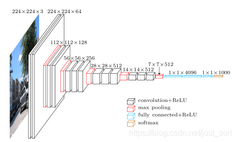

### GooleNet（也叫Inception V1，2014）

- 引入了Inception模块：融合不同尺度的特征信息

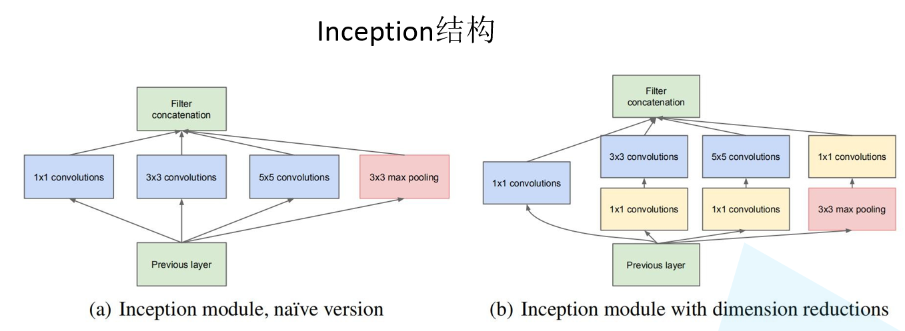
- Inception 模块中的卷积步长都是 1，另外为了保持特征图大小一致，都设置了 Padding 方式为 Same。每个卷积层后面都接了 ReLU 激活函数。在输出前有一个 Concat 层代表把 4 组不同类型但大小相同的特征响应图堆叠在一起，获得输出特征图。Inception 模块一共使用了 4 种不同大小的卷积核对输入特征图进行了特征提取。

- 使用1x1卷积进行通道数的变化以及增加非线性作用，同时也减少参数量。
- 添加两个辅助分类器帮助训练。两个辅助的softmax分支，作用有两点：
  - 一是为了避免梯度消失，用于向前传导梯度。反向传播时如果有一层求导为0，链式求导结果则为0。
  - 二是将中间某一层输出用作分类，起到模型融合作用。最后的loss=loss_2 + 0.3 * loss_1 + 0.3 * loss_0。实际测试时，这两个辅助softmax分支会被去掉。
- 丢弃了全连接层，使用了平均池化层。AlexNet 最后的三个全连接层的参数量占了总参数量的差不多 90%，GoogLeNet 移除了全连接层使用全局平均池化层进行代替并证明了这种方式实现的精度更好，并且推理速度也明显加快。

### Inception V2（2015）

- 提出了BN层，每个卷积层后面都有 BN 层
- 与VGG一样，用多个小卷积代替一个大卷积，并获得了相同大小的卷积核

- Inception系列的trick
  - 采用了标签平滑：以前构造标签的时候实际是哪一类就置 1，其他类的都置为 0，不够平滑，学习时就会很难，容易过拟合。所以标签平滑就是给真实标签最大值，也按照概率给其他类一些值，如给一些根号值。
  - 使用了合适的下采样方法：把特征图拆成两部分，一部分直接池化下采样，一个做两层3x3卷积的下采样，再把两种信息连到一起，这样通过分开的方式相对于以前的方法挖掘到不同的信息更多。

#### Inception V3（2015）

Inception V3一个最重要的改进是卷积分解（Factorization），将7x7卷积分解成两个一维的卷积串联（1x7和7x1），3x3卷积分解为两个一维的卷积串联（1x3和3x1），这样既可以加速计算，又可使网络深度进一步增加，增加了网络的非线性（每增加一层都要进行ReLU）。

#### Inception V4（2016）

与ResNet结合。论文说引入ResNet中的Residual Blocks结构不是用来提高准确度，只是用来提高模型训练收敛速度。

### ResNet（2015）

- ResNets要解决的是深度神经网络的“退化”问题
  - 对浅层网络逐渐叠加layers，模型在训练集和测试集上的性能会变好，因为模型复杂度更高了，表达能力更强了，可以对潜在的映射关系拟合得更好。而“退化”指的是，给网络叠加更多的层后，性能却快速下降的情况。

- ResNet原理
  - 假设我们想要网络块学习到的映射为H(x)，而直接学习H(x)是很难学习到的。若我们学习另一个残差函数F(x) = H(x) - x可以很容易学习，因为此时网络块的训练目标是将F(x)逼近于0，而不是某一特定映射。因此，最后的映射H(x)就是将F(x)和x相加，H(x) = F(x) + x。

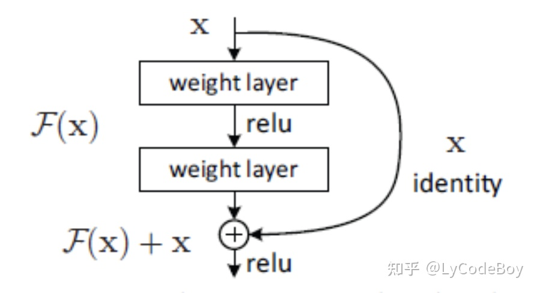

- ResNet两种结构

  - 左边的残差结构是针对层数较少网络，例如ResNet18层和ResNet34层网络。右边是针对网络层数较多的网络，例如ResNet101，ResNet152等。为什么深层网络要使用右侧的残差结构呢。因为，右侧的残差结构能够减少网络参数与运算量。同样输入一个channel为256的特征矩阵，如果使用左侧的残差结构需要大约1170648个参数，但如果使用右侧的残差结构只需要69632个参数。明显搭建深层网络时，使用右侧的残差结构更合适。

    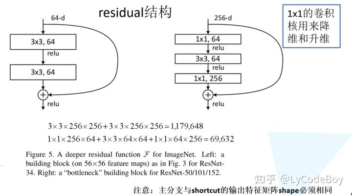

- 如果残差映射(F(x))的结果的维度与跳跃连接(x)的维度不同，那咱们是没有办法对它们两个进行相加操作的，必须对x进行升维操作，让他俩的维度相同时才能计算。要么用0填充，要么使用1x1的卷积

### ResNeXt（2016）

- 传统的要提高模型的准确率，都是加深或加宽网络，但是随着超参数数量的增加（比如channels数，filter size等等），网络设计的难度和计算开销也会增加。因此提出的 ResNeXt 结构可以在不增加参数复杂度的前提下提高准确率，同时还减少了超参数的数量。
- ResNeXt的本质是分组卷积，通过变量基数来控制组的数量。分组卷积是介于普通卷积以及深度可分离卷积的一种折中方案，不是彻底的将每个channel都要单独赋予一个独立的卷积核也不是整个Feature Map使用同一个卷积核。
- Inception 系列网络有个问题：网络的超参数设定的针对性比较强，当应用在别的数据集上时需要修改许多参数，因此可扩展性一般。ResNext不需要人工设计复杂的Inception结构细节，而是每一个分支都采用相同的拓扑结构。
  - 该体系结构采用VGG / ResNets的重复层策略，同时以简单，可扩展的方式利用拆分转换合并策略。网络中的一个模块执行一组转换，每个转换都在低维嵌入中进行，其输出通过求和进行汇总。
- split-transform-merge 模式是作者归纳的一个很通用的抽象程度很高的标准范式。

### DenseNet（2016）

- DenseNet的思路和ResNet大概一致，但是它的主要思想是前面所有层与后面所有层进行密集连接，也就是说通过特征在通道这个维度上进行连接来实现特征重用。

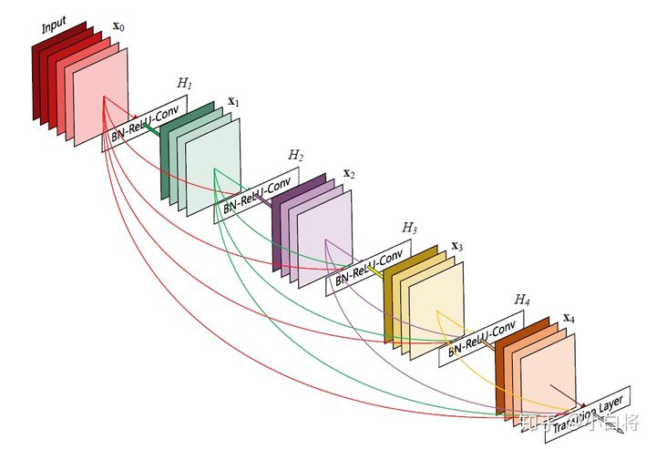

- 与Resnet将该层和前面几层进行短路连接进行元素级别的相加不一样，在DenseNet中，对于一个L层的网络，那么就有Lx（L+1）/2个密集连接。由于密集连接的方式，DenseNet提升了梯度的反向传播，使网络更加容易训练，也使得每层可以直达最后的误差信号。
- ResNet是通过Add相加，而DenseNet是通过DenseNet直接concat来自不同层的特征图
- 因为DenseNet要进行许多连接，所以它们层与层之间的特征维度就会比较小，也就是生成的网络较窄。
- 因为要进行concat连接，因此特征图大小需要保持一致，DenseNet网络中采用了DenseBlock+Transition连接方式。
  - DenseBlock是包含很多层的模块，每个层的特征图大小相同，以及层与层之间采用密集连接的方式。由于后面层的输入会非常大，DenseBlock内部可以采用bottleneck层来减少计算量，主要是原有的结构中增加1x1卷积。
  - 而Transition结构是连接两个相邻的DenseBlock，并通过Pooling使特征图大小降低，起到压缩模型的作用。

### SqueezeNet（2017）

SqueezeNet系列是比较早期且经典的轻量级网络，SqueezeNet的核心是使用Fire模块进行参数压缩。虽然SqueezeNet系列不如MobieNet使用广泛，但是它的架构思想和实验结论还是有借鉴意义的。

- 采用1x1卷积代替3x3卷积，减少卷积核参数的数量（9倍），同时也改变通道数
- 延迟降采样，作者认为较大的Feature Map含有更多的信息，因此将降采样往分类层移动，保留更多的信息，提高分类的准确率。注意这样的操作虽然会提升网络的精度，但是它有一个非常严重的缺点：即会增加网络的计算量。
- 使用Fire模块，包括先压缩再扩展。Squeeze部分由一系列1x1的卷积组成，Expand部分则是由一组连续的1x1卷积和一组连续的3x3卷积concatnate融合组成，即压缩完之后使用多个尺寸地卷积进行计算，以达到扩展的目的。

- Concat合并：对得到的两个特征图进行通道拼接，作为最终输出

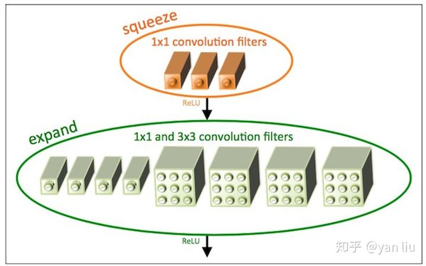

- SqueezeNext的设计沿用残差结构，没有使用当时流行的深度分离卷积，而是直接使用了分离卷积，设计主要基于以下策略：
  - Low Rank Filters：低秩分解的核心思想就是将大矩阵分解成多个小矩阵，这里使用CP分解(Canonical Polyadic Decomposition)，将卷积分解成和的分离卷积，以降低参数量。
  - Bottleneck Module：参数量与输入输出维度有关，虽然可以使用深度分离卷积来减少计算量，但是深度分离卷积在终端系统的计算并不高效。因此采用SqueezeNet的squeeze层进行输入维度的压缩，每个block的开头使用连续两个squeeze层，每层降低1/2维度。
  - Fully Connected Layers：在AlexNet中，全连接层的参数占总模型的96%，SqueezeNext使用bottleneck层来降低全连接层的输入维度，从而降低网络参数量。

### MobilenetV1（2017）

MobileNetV1基于深度可分离卷积构建了非常轻量且延迟小的模型，并且可以通过两个超参数进一步控制模型的大小，该模型能够应用到终端设备中，具有很重要的实践意义。

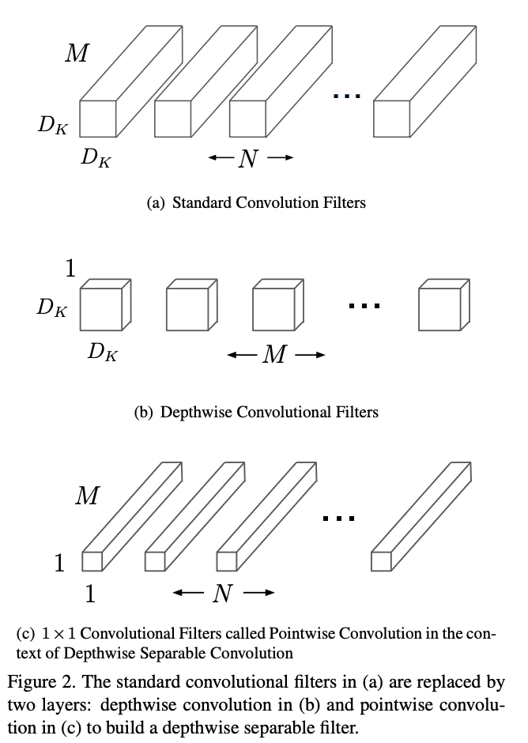

- MobilenetV1就是将VGG的标准卷积层替换成了深度可分离卷积，也就是采用了深度可分离卷积：空间卷积（一般是3x3）+通道卷积（1x1卷积，也叫逐点卷积）。我们知道1x1的卷积可以用来改变通道数，即升维、降维，因此我们可以设置mobilenetV1中的alpha值改变它的通道数。

  - 对于普通卷积而言，假设有一个3×3大小的卷积层，其输入通道为16、输出通道为32。具体为，32个3×3大小的卷积核会遍历16个通道中的每个数据，最后可得到所需的32个输出通道，所需参数为16×32×3×3=4608个。

    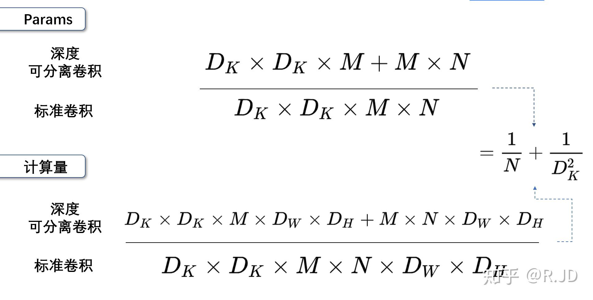

    因为卷积核的大小一般为3x3，所以理论上是普通卷积计算量的八分之一到九分之一。

  - 对于深度可分离卷积结构块而言，假设有一个深度可分离卷积结构块，其输入通道为16、输出通道为32，其会用16个3×3大小的卷积核分别遍历16通道的数据，得到了16个特征图谱。在融合操作之前，接着用32个1×1大小的卷积核遍历这16个特征图谱，所需参数为16×3×3+16×32×1×1=656个。

  - 因此Mobilenet可以通过使用更少的参数、更少的运算就能达到和普通卷积差不多的结果。

  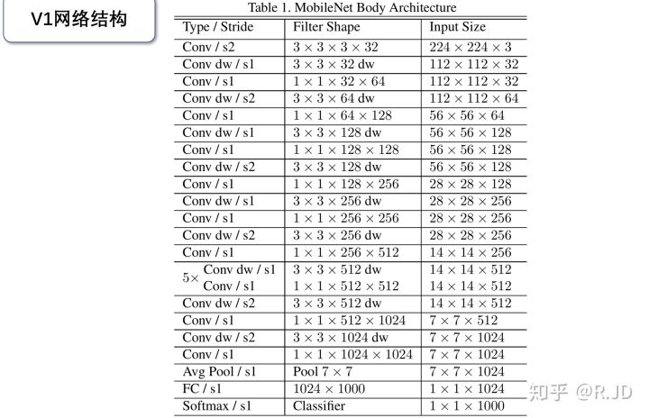

- MobilenetV1的结构如上，整个网络有28层，其中深度卷积层有13层。首先进行3x3的卷积，stride为2进行下采样。之后就是依次进行堆叠深度可分离卷积了，并且使用深度可分离卷积的时候，部分会使用stride为2的步长。提取完特征之后就采用平均池化将特征调整为1x1的特征长条，根据预测的类别数目进行全连接与softmax。

- 在MobilenetV1中也加入了ReLU6。ReLU6也就是ReLU的变体，当值大于6的时候，就返回6，也就是以6为上边界。**作者认为ReLU6作为非线性激活函数，在低精度计算下具有更强的鲁棒性。**

  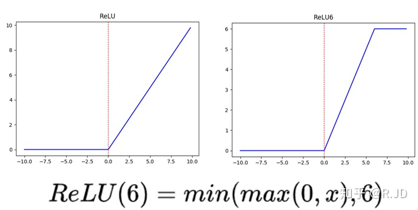

### ShuffleNetV1（2017）

ShuffleNetV1的核心是使用通道混洗的操作来弥补分组之间的信息交流，使得网络可以尽情使用pointwise分组卷积。这样不仅可以减少网络的计算量，还可以增加卷积的维度以及增加通道间的信息交流。

- 模型加速有好几个方面：网络剪枝、减少通道数、量化、因式分解计算中的冗余等，不过ShuffleNet更加注重于设计模型来提高性能，而不是通过加速或者转换。
- 通过高效网络设计，在保持精度的同时大大减少了参数量以及计算量
- 使用了分组卷积的思想，分组卷积最早是在AlexNet中使用，因为当时GPU资源不足
- 在目前的一些主流网络中，通常使用pointwise卷积进行维度的降低，从而降低网络的复杂度，但由于输入维度较高，pointwise卷积的开销也是十分巨大的。对于小网络而言，昂贵的pointwise卷积会带来明显的性能下降，比如在ResNext unit中，pointwise卷积占据了93.4%的计算量。为此，使用了组卷积替代了第一个1x1的卷积，因为1x1的逐点卷积需要很大的计算复杂度。

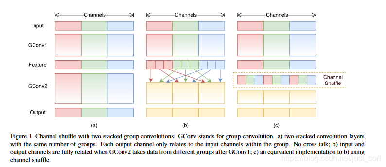

- 因为组卷积之间虽然能够减少参数量和计算量，但是不同组之间的信息没有交互，所以提出了channel shuffle的思想
  - 对一个卷积层分为 g 组，每组有 n 个通道
  - reshape 成 (g, n)
  - 再转置为 (n, g)
  - Flatten 操作，分为 g 组作为下一层的输入。
  - 通道 Shuffle 操作是可微的，模型可以保持 end-to-end 训练。

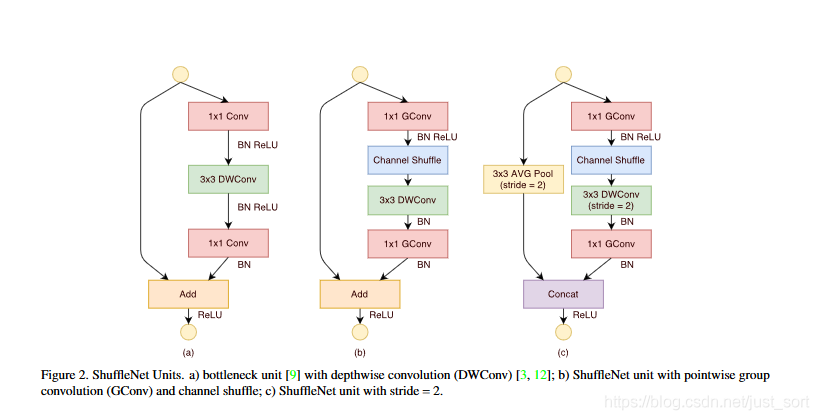

- 但是一些模型，随着组数的增加，性能却有所下降，可能是每个卷积滤波器上的输入通道也越来越少，损害了模型的表达能力。 值得注意的是，对于小型的 ShuffleNet 0.25×，组数越大性能越好，这表示对于小模型更宽的特征映射更有效。

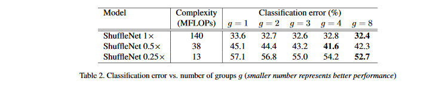

### MobilenetV2（2018）

MobileNetV2提出创新的inverted residual with linear bottleneck单元，虽然层数变多了，但是整体网络准确率和速度都有提升。

- Linear bottleneck

  - MobilenetV2引入了线性的激活层，并且是将最后的ReLU6换成了Linear。
  - MobileNetV2首先表明高维特征实际可以用紧凑的低维特征表达，然后提出了新的层单元inverted residual with linear bottleneck，该结构与残差网络单元类似，都包含shorcut，区别在于该结构是输入输出维度少，中间通过线性卷积先扩展升维，然后通过深度卷积进行特征提取，最后再映射降维，可以很好地保持网络性能且网络更加轻量。

  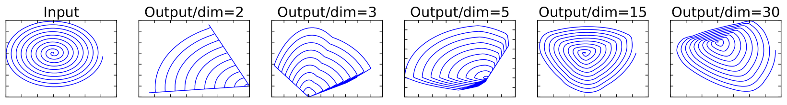          

  - 上图是对一个n维空间的数据进行ReLU运算后在逆操作后的结果，可以看出：当n = 2,3时，与Input相比有很大一部分的信息已经丢失了。而当n = 15到30，还是有相当多的地方被保留了下来。所以说，对低维数据进行ReLU进行运算，就很容易导致信息的丢失；而对高维数据进行ReLU运算，丢失的信息则会很少。
  - 这也解释了为什么深度卷积的卷积核中有许多参数是空的，因此这里将ReLU替换成线性激活函数。

- Expansion layer

  - 这里引入了扩张通道的概念。因为如果来的通道很少的话，DW深度卷积只能在低维度上工作，这样效果并不会很好，所以我们打算进行通道的扩张。而且知道PW逐点卷积可以用来升维和降维，那么就可以在DW深度卷积之前使用PW卷积进行升维，这里的升维倍数为t（t=6），然后再在一个更高维的空间中进行卷积操作来提取特征，提取特征完之后再进行压缩，还原为原来的通道数。

    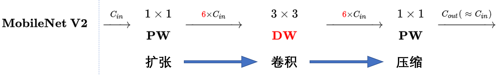

  - 所以上述Linear bottleneck就只替换了最后的ReLU，因为不管输入的通道是多少，都会在6倍以上维度上进行工作。

- Inverted residuals

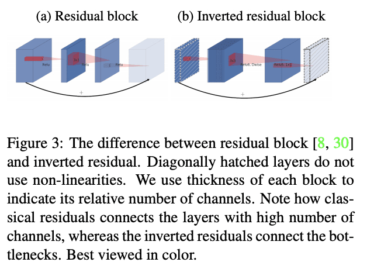

- 这里受到了Resnet的Shortcut启发，因为v1结构还是VGG网络，而不是像Resnet网络一样有宽有窄的网络结构，所以V2引入了shortcut的结构。不同的是，这里使用的是先升维进行卷积，再进行降维操作，而Resnet是先降维进行卷积，再进行升维操作。所以也叫作Inverted residuals，也叫倒残差结构。

- 从Resnet中，知道相加的话需要特征矩阵的shape要完全一样才能相加，所以上面进行扩张后还需要进行压缩，来保证shape一样。

  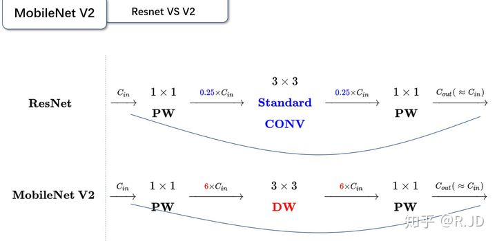

  - 对比一下V1和V2：

  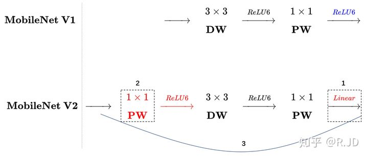

### ShuffleNetV2（2018）

ShuffleNetV1的pointwise分组卷积以及bottleneck结果均会提高MAC，导致不可忽视的计算损耗。为了达到高性能以及高准确率，关键是在不通过稠密卷积以及过多分组的情况下，获得输入输出一样的大维度卷积。ShuffleNet V2从实践出发，以实际的推理速度为指导，总结出了轻量级网络的设计要领，并根据要领提出了ShuffleNetV2，很好地兼顾了准确率和速度，其中channel split操作十分亮眼，将输入特征分成两部分，达到了类似DenseNet的特征重用效果。

- FLOPS，每秒浮点运算次数，计算速度，衡量硬件性能的指标；FLOPs，浮点运算数，计算量衡量算法的复杂度

- 大部分的模型加速和压缩的论文在对比加速效果时的指标都是 FLOPS，这个指标主要衡量的就是乘法和加法指令的数量。而这篇论文通过一系列实验发现 FLOPS 并不能完全衡量模型的速度

- 提出四条高效设计网络的准则：

  - 当卷积层的输入与输出的通道数相等时MAC最小，MAC（内存访问时间）

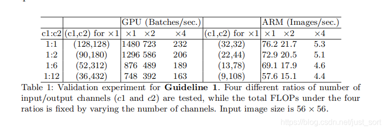

- 假设一个1×1卷积层的输入特征图通道数是c1，输入特征图尺寸是h和w，输出特征通道数是c2，那么这样一个1×1卷积层的FLOPS就是：B=c1∗c2∗h∗w∗1∗1。

  接下来看看存储空间，因为是1×1卷积，所以输入特征和输出特征的尺寸是相同的，这里用h和w表示，其中h×w×c1表示输入特征所需要的存储空间，h×w×c2表示输出特征所需空间，c1×c2表示卷积核所需存储空间。

  所以，MAC=h×w(c1+c2)+c1×c2

  根据均值不等式推出:

  MAC>=2√hwB+Bhw

  再把 MAC 和 B 带入式子 1 就得到(c1−c2)2>=0，因此等式成立的条件是c1=c2，也就是输入特征通道数和输出通道特征数相等时，在给定 FLOPs 前提下，MAC 达到取值的下界。

- 当组卷积中组的数目增大时，MAC也会变大，从而使模型变慢

  - 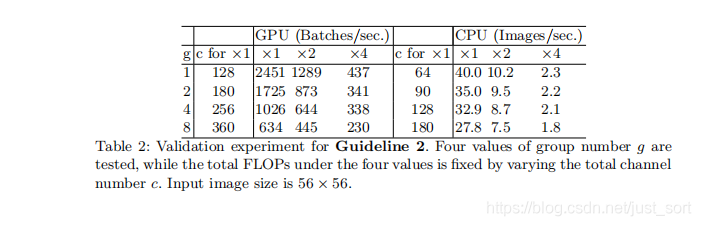

  - 带 group 操作的1×1卷积的 FLOPs 如下所示：

    B=h×w×c1×c2/g

    多了一个除数g，g表示group数量。这是因为每个卷积核都只和c1/g个通道的输入特征做卷积，所以多个一个除数g。

    同样 MAC 为：

    MAC=h×w×(c1+c2)+c1×c2/g

    这样就能得到 MAC 和B之间的关系了，如下面的公式所示，可以看出在B不变时，g越大，MAC就越大。

    MAC=h×w×(c1+c2)+c1×c2/g=MAC=h×w×(c1+c2)+c1×c2/g= h×w×c1+B×g/c1+B/(h×w)

- 网络碎片化程度越高，速度越慢，即分支越多，模型越慢，因为对并行计算不利，在GPU上影响更加明显，而ARM上影响相对小一些

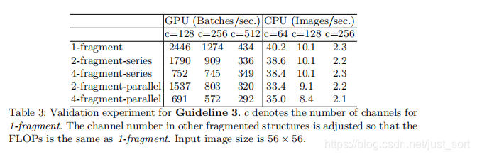
- 其中fragment为网络的支路数量

- FLOPS主要表示的是卷积层的时间消耗，而element-wise操作虽然基本不增加FLOPS，但element-wise（ReLU、shortcut等）的操作带来的影响不可忽视， element-wise 操作所带来的时间消耗远比在 FLOPS 上体现的数值要多，因此要尽可能减少element-wise操作

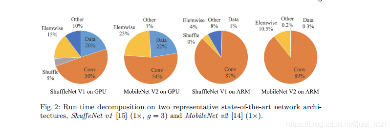

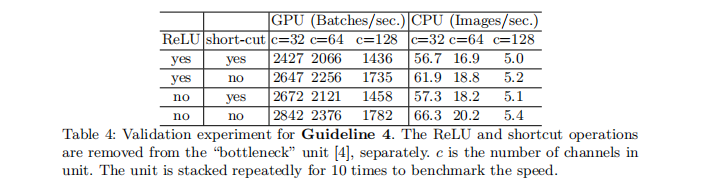

- 瓶颈结构的设计：

  - 这张图中的`(a)`和`(b)`是 ShuffleNet V1 的两种不同的`block`结构，两者的差别在于`(b)`对特征图分辨率做了缩小。`(c)`和`(d)`是 ShuffleNet V2 的两种不同结构。从`(a)`和`(c)`对比可知`(c)`在开头增加了一个通道分离 (`channel split`) 操作，这个操作将输入特征通道数c 分成了c−c′和c′，在论文中c′取c/2，这主要是为了改善实验 1。然后`(c)`取消了1×1卷积层中的分组操作，这主要为了改善实验 2 的结论，同时前面的通道分离其实已经算是变相的分组操作了。其次，`channel shuffle`操作移动到了 concat 操作之后，这主要为了改善实验 3 的结果，同时也是因为第一个1×1 卷积层没有分组操作，所以在其后面跟`channel shuffle`也没有太大必要。最后是将`element-wise add`操作替换成`concat`，这和前面的实验 4 的结果对应。`（b）`和`（d）`的对比也是同理，只不过因为`（d）`的开始处没有通道分离操作，所以最后`concat`后特征图通道数翻倍。

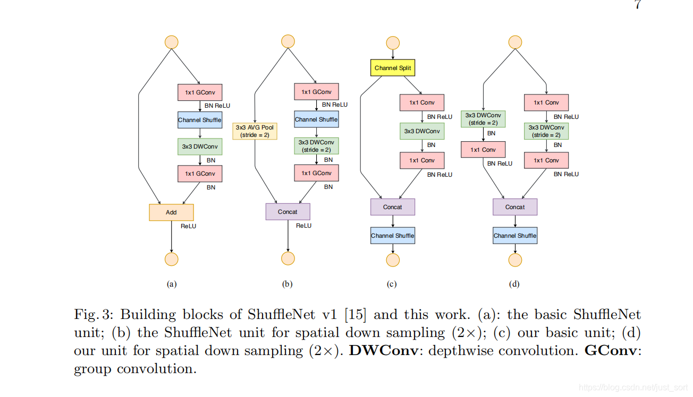

### MobilenetV3（2019）

  MobileNetV3先基于AutoML构建网络，然后进行人工微调优化，搜索方法使用了platform-aware NAS以及NetAdapt，分别用于全局搜索以及局部搜索，而人工微调则调整了网络前后几层的结构、bottleneck加入SE模块以及提出计算高效的h-swish非线性激活，以进行更加轻量的网络构建。

- 激活函数h-swish

  - swish具备无上界有下界、平滑、非单调的特性。并且swish在深层模型上的效果优于ReLU。

  - swish缺点：

    - 计算求导复杂
    - 对量化不友好
    - 在嵌入式设备上计算需要花不少成本

  - h-swish是基于swish的改进，作者的思想是用一个近似函数来逼急这个swish，让swish变得硬(hard)，可以认为是soft形式的低精度版本。作者选择的是基于ReLU6，作者认为几乎所有的软件和硬件框架上都可以使用ReLU6的优化实现。其次，它能在特定模式下消除了由于近似sigmoid的不同实现而带来的潜在的数值精度损失。

    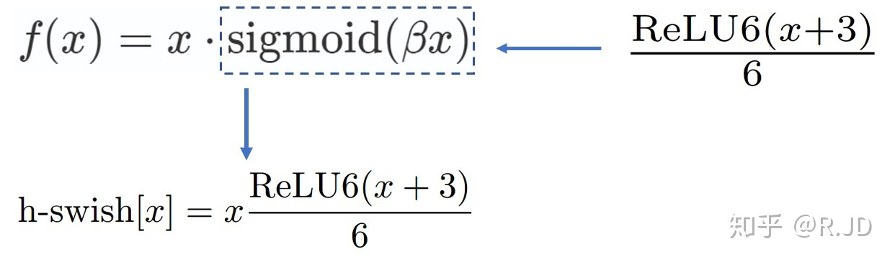

    - 对比Sigmoid和swish的hard、soft形式：

      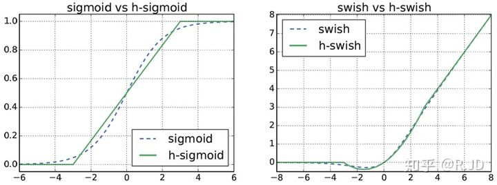

  - 随着网络的加深，使用非线性激活函数的成本也会随之降低，所以可以更好地减少参数量。所以在MobilenetV3中，只在模型的后半段使用了h-swish。

- 注意力模块SE

  - 这里注意力机制的想法是先对经过一系列卷积运算的输入特征的矩阵经过全局池化操作，进行向量化然后再加两个全连接层。注意这里的第一个全连接层维度是输入特征的四分之一，第二个则恢复原来的维度大小。
  - 这里可以理解为经过两个全连接层，得出输入特征矩阵的各个位置的重要程度的权重矩阵。

  

- 网络搜索NAS

  - 这里的NAS是通过搜索参数的方法来确定每一层、每一个块的卷积核数量，而不是像v1、v2一样人为设计网络。

- 重新设计耗时层

  - 减少第一个卷积层的卷积核个数：因为发现将卷积核个数从32变为16后，模型准确率没有改变。

  - 精简Last Stage

    

### EfficientNetV1（2019）

论文对模型缩放进行深入研究，提出混合缩放方法，该方法可以更优地选择宽度、深度和分辨率的维度缩放比例，从而使得模型能够达到更高的精度。另外，论文通过NAS神经架构搜索提出EfficientNet，配合混合缩放方法，能够使用很少量的参数达到较高的准确率。

- 同时探索输入分辨率、网络深度、宽度的影响，通过简单的按比例缩放每个维度来实现三者的平衡：
  - 增加网络的深度可以得到更加丰富、复杂的特征，但过深可能导致梯度消失、训练困难
  - 增加网络的宽度能获得更加高的细粒度特征，也更加容易学习，但是过大的宽度而深度较浅的网络往往很难学到更深层次的特征
  - 增加输入网络图像分辨率能够获得更高细粒度的特征模板，但是对于非常高的输入分辨率，计算量十分大，准确率的增益也会减小

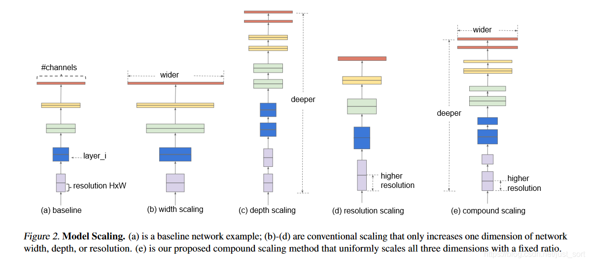

- 使用SE模块，由一个全局池化，两个全连接层组成。第一个全连接层的通道数前面通道数的四分之一，且使用swich激活函数；第二个全连接层输出层维度进行扩增、恢复，且使用sigmoid激活函数。
- 使用NAS方法搜索网络的参数，并扩展为一系列的模型，共有B0-B7一共八个模型

### ResNeSt（2020）

- ResNeSt全称叫做Split-Attention Networks，使用了模型的拆分注意力网络
- split(multi-brach)，分组再拆。即在同一层中多个卷积核可以分别提取特征使得网络提取的特征多样化。
  - 这里使用两个拆分cardinality和radix，先均分成k个cardinality，再分成R个radix，因此最后特征图是G=KxR份。
  - cardinality层级：使用了nn.Conv2d中的groups参数将输入特征分成Cardinality=K组
  - radix层级：先使用了一个3x3的conv2d将通道数增加到channels*radix后，再用torch.split分成将特征层分成radix组输入。
- Channel-attention：引入软注意力机制实现特征通道之间的权重分配，这里计算权重的方法为使用r-softmax，最后将各组对应的特征层与atten系数相乘再求和。

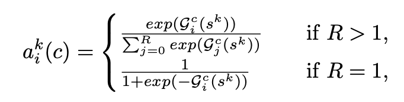

- split-attention block：SplAtConv2d模块中包括三组conv2d，卷积核分别为3x3, 1x1, 1x1，通道数都是64=>128, 64=>32, 32=>128。SplAtConv2d基本运算规则：
  - 通过conv将通道数乘以radix系数；
  - 通过split操作将特征分成radix组数据splited特征，并将通过跨多个拆分的元素相加后进行avg_pooling操作得到中间gap特征；
  - 然后通过fc1压缩通道数，通过fc2将通道数提升到in_channels*radix的atten特征
  - 通过split操作将atten分成radix组的attens特征，将attens与splited对应通道相乘，再相加最终得到与输入特征维度相同的特征层

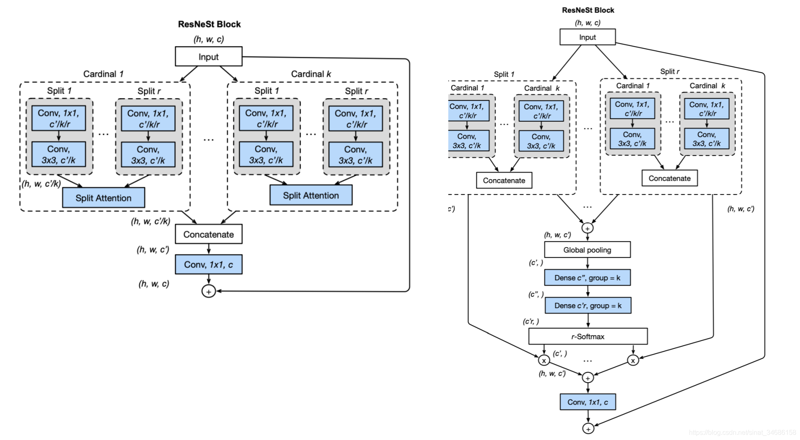

- 平均下采样：当迁移学习的下游应用是密集的预测任务（例如检测或分段）时，保留空间信息就变得至关重要。卷积层需要使用零填充策略来处理特征图边界，这在转移到其他密集的预测任务时通常不是最佳的。 而不是在过渡块（对空间分辨率进行下采样）上使用分步卷积，因此这里使用内核大小为3x3的平均池化层。

- tricks
  - 基于resnet-d：将第一个7x7卷积层替换为三个连续的3x3卷积层
  - 基于resnet-d：对于步长为2的过渡块，在1x1卷积层之前，将2x2平均池化层添加到快捷连接
  - Large Mini-batch Distributed Training.
  - Label Smoothing
  - Auto Augmentation.
  - Mixup Training
  - Large Crop Size
  - Regularization

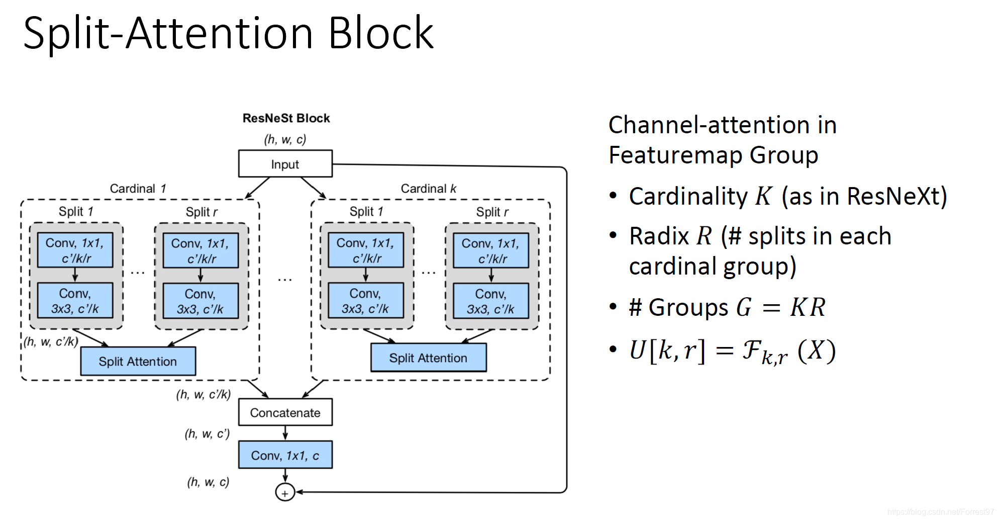

### EfficientNetV2（2021）

- 引入Fused-NBConv模块，因为的浅层使用depthwise conv会很慢
- 引入渐进式学习策略，训练更快，从v1的更关注参数量到v2的更关注训练速度
  - 训练初期使用较小的尺寸，随后逐渐提升图像的尺寸
  - 初期使用较弱的正则方法，随后逐渐使用dropout、mixup等正则方法
- 发现同等放大每个stage是次优的，所以采用了非均匀的缩放策略缩放模型。
