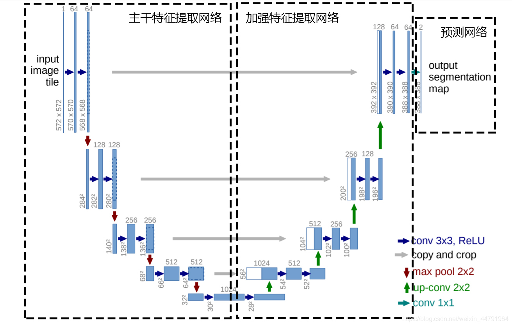
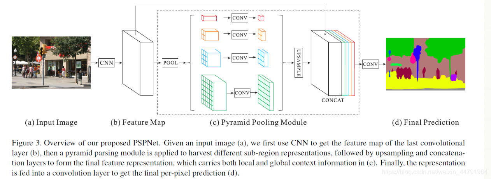

### 分割概览

语义分割是对所给定的一张图片，对图片中的每一个像素进行分类。

实例分割是对图像中的每一个像素点进行分类，同种物体的不同实例也用不同的类进行标注.

### FCN

#### 简述

FCN，全卷积神经网络，是目前做语义分割的最常用的网络。是2015年发表在CVPR上的一片论文，提出了全卷积神经网络的概念，全连接层也可以看作是卷积层，只不过卷积核是原图大小而已。

FCN与CNN之间的区别就是把最后几层的全连接层换成了卷积层，FCN最后的卷积层不再与FC层相连而是加入一个全局池化层，这样做的好处就是能够突破尺寸的限制输出的是feature map，而不是类别。从而实现FCN对图像进行像素级的分类，解决了语义级别的图像分割。

与经典的CNN在卷积层之后使用全连接层得到固定长度的特征向量进行分类（全连接层＋softmax输出）不同，FCN可以接受任意尺寸的输入图像，采用反卷积层对最后一个卷积层的feature map进行上采样， 使它恢复到输入图像相同的尺寸，从而可以对每个像素都产生了一个预测， 同时保留了原始输入图像中的空间信息， 最后在上采样的特征图上进行逐像素分类。

#### 整体流程

对原图像进行卷积conv1、pool1后原图像缩小为1/2；之后对图像进行第二次conv2、pool2后图像缩小为1/4；接着继续对图像进行第三次卷积操作conv3、pool3缩小为原图像的1/8，此时保留pool3的featureMap；接着继续对图像进行第四次卷积操作conv4、pool4，缩小为原图像的1/16，保留pool4的featureMap；

最后对图像进行第五次卷积操作conv5、pool5，缩小为原图像的1/32，然后把原来CNN操作中的全连接变成卷积操作conv6、conv7，图像的featureMap数量改变但是图像大小依然为原图的1/32，此时进行32倍的上采样可以得到原图大小，这个时候得到的结果就是叫做FCN-32s。

这个时候可以看出，FCN-32s结果明显非常平滑，不精细。 针对这个问题，作者是在FCN-32s的基础上进行fine tuning，把pool4层和conv7的2倍上采样结果相加之后进行一个16倍的上采样，得到的结果是FCN-16s。

之后在FCN-16s的基础上进行fine tuning，把pool3层和2倍上采样的pool4层和4倍上采样的conv7层加起来，进行一个8倍的上采样，得到的结果就是FCN-8s。可以看出结果明显是FCN-8s好于16s，好于32s的。

#### FCN优缺点

FCN的优点，能够end-to-end， pixels-to-pixels，而且相比于传统的基于cnn做分割的网络更加高效，因为避免了由于使用像素块而带来的重复存储和计算卷积的问题。

FCN的缺点也很明显，首先是训练比较麻烦，需要训练三次才能够得到FCN-8s，而且得到的结果还是不精细，对图像的细节不够敏感，这是因为在进行decode，也就是恢复原图像大小的过程时，输入上采样层的label map太稀疏，而且上采样过程就是一个简单的deconvolution。
其次是对各个像素进行分类，没有考虑到像素之间的关系。忽略了在通常的基于像素分类的分割方法中使用的空间规整步骤，缺乏空间一致性。

### deeplab系列

#### 简述Deeplab v1网络

DeepLab是结合了深度卷积神经网络（DCNNs）和概率图模型（DenseCRFs）的方法。在实验中发现DCNNs做语义分割时精准度不够的问题，根本原因是DCNNs的高级特征的平移不变性（即高层次特征映射，根源在于重复的池化和下采样）。针对信号下采样或池化降低分辨率，DeepLab是采用的atrous（带孔）算法扩展感受野，获取更多的上下文信息。另外，DeepLab 采用完全连接的条件随机场（CRF）提高模型捕获细节的能力。论文模型基于 VGG16，在 Titan GPU 上运行速度达到了 8FPS，全连接 CRF 平均推断需要 0.5s ，在 PASCAL VOC-2012 达到 71.6% IOU accuracy。

#### 简述Deeplab v2网络

DeepLabv2 是相对于 DeepLabv1 基础上的优化。DeepLabv1 在三个方向努力解决，但是问题依然存在：特征分辨率的降低、物体存在多尺度，DCNN 的平移不变性。

因 DCNN 连续池化和下采样造成分辨率降低，DeepLabv2 在最后几个最大池化层中去除下采样，取而代之的是使用空洞卷积，以更高的采样密度计算特征映射。物体存在多尺度的问题，DeepLabv1 中是用多个 MLP 结合多尺度特征解决，虽然可以提供系统的性能，但是增加特征计算量和存储空间。论文受到 Spatial Pyramid Pooling (SPP) 的启发，提出了一个类似的结构，在给定的输入上以不同采样率的空洞卷积并行采样，相当于以多个比例捕捉图像的上下文，称为 ASPP (atrous spatial pyramid pooling) 模块。

相比于DeepLab v1，deeplab v2在之前的基础上做了三个方面的贡献：一是使用Atrous Convolution 代替原来上采样的方法，比之前得到更高像素的score map，并且增加了感受野的大小；二是使用ASPP 代替原来对图像做预处理resize 的方法，使得输入图片可以具有任意尺度，而不影响神经网络中全连接层的输入大小；三是使用全连接的CRF，利用低层的细节信息对分类的局部特征进行优化。

论文模型基于 ResNet，在 NVidia Titan X GPU 上运行速度达到了 8FPS，全连接 CRF 平均推断需要 0.5s ，在耗时方面和 DeepLabv1 无差异，但在 PASCAL VOC-2012 达到 79.7 mIOU。

#### 简述Deeplab v3网络相比于之前的v1和v2网络有哪些改进

①重新讨论了空洞卷积的使用，这让我们在级联模块和空间金字塔池化的框架下，能够获取更大的感受野从而获取多尺度信息。

②改进了ASPP模块：由不同采样率的空洞卷积和BN层组成，我们尝试以级联或并行的方式布局模块。

③讨论了一个重要问题：使用大采样率的3×3的空洞卷积，因为图像边界响应无法捕捉远距离信息，会退化为1×1的卷积， 我们建议将图像级特征融合到ASPP模块中。

④阐述了训练细节并分享了训练经验。

**介绍deeplabv3，画出backbone**

DeepLab V3将空洞卷积应用在了级联模块，并且改进了ASPP模块。backbone还是resnet 101。 增强ASPP模块，复制resnet最后的block级联起来，加入BN。没有使用CRFs新的ASPP模块包括：一个1×1卷积和3个3×3的空洞卷积(采样率为(6，12，18))，每个卷积核都有256个且都有BN层；包含图像级特征image-level features(即全局平均池化Global Avearge Pooling)；所有分支得到的结果concate起来通过1×1卷积之后得到最终结果。

DeepLab V3采用atrous convolution的上采样滤波器提取稠密特征映射和去捕获大范围的上下文信息。具体来说，编码多尺度信息，提出的级联模块逐步翻倍的atrous rates，提出的atrous spatial pyramid pooling模块增强图像级的特征，探讨了多采样率和有效视场下的滤波器特性。实验结果表明，该模型在Pascalvoc 2012语义图像分割基准上比以前的DeppLab版本有了明显的改进，并取得了与其他先进模型相当的性能。

**DeepLab V3的改进**主要包括以下几方面：1）提出了更通用的框架，适用于任何网络

2）复制了ResNet最后的block，并级联起来3）在ASPP中使用BN层4）去掉了CRF。

**deeplabv3的损失函数**交叉熵损失函数

#### deeplabv3+系列

DeepLabv3 +采用编码器解码器结构扩展了DeepLabv3。 编码器模块通过在多个尺度上应用atrous卷积来编码多尺度上下文信息，而简单但有效的解码器模块沿着对象边界细化分割结果。DeepLabv3+模型中使用ResNet-101作为网络主干。探索Xecption模型， 将depthwise separable convolution应用到ASPP和解码模块上(更快，更稳定)。

#### 条件随机场(CRF)后处理的目的

CRF使像素级别的类别标签的多类别输出与底层图像信息（如像素间的相互关系）有关，这种结合尤其重要，这也是关注于局部细节的CNN所未能考虑到的。CRF 将图像中每个像素点所属的类别都看作一个变量xi，然后考虑任意两个变量之间的关系，建立一个完全图。

### UNet

#### 简述

UNet网络可以简单看为先下采样，经过不同程度的卷积，学习了深层次的特征，再经过上采样恢复为原图大小，上采样用反卷积实现。输出类别数量的特征图，最后使用激活函数softmax将特征图转换为概率图，针对某个像素点，如输出是[0.1，0.9]，则判定这个像素点是第二类的概率更大。

网络结构可以看成3个部分：

①下采样：网络的红色箭头部分，池化实现

②上采样：网络的绿色箭头部分，反卷积实现

③最后层的softmax：在网络结构中，最后输出两张feeaturemaps后，其实在最后还要做一次softmax，将其转换为概率图。

#### 整体流程

Unet可以分为三个部分，如下图所示：

第一部分是主干特征提取部分，我们可以利用主干部分获得一个又一个的特征层，Unet的主干特征提取部分与VGG相似，为卷积和最大池化的堆叠。利用主干特征提取部分我们可以获得五个初步有效特征层，在第二步中，我们会利用这五个有效特征层可以进行特征融合。

第二部分是加强特征提取部分，我们可以利用主干部分获取到的五个初步有效特征层进行上采样，并且进行特征融合。特征融合的方式就是对特征层进行上采样并且进行堆叠，最终获得一个融合了所有特征的有效特征层。

第三部分是预测部分，我们会利用最终获得的最后一个有效特征层对每一个特征点进行分类，相当于对每一个像素点进行分类。

#### LOSS解析

LOSS由两部分组成：
1、Cross Entropy Loss。
2、Dice Loss。

Cross Entropy Loss就是普通的交叉熵损失，当语义分割平台利用Softmax对像素点进行分类的时候，进行使用。

Dice loss将语义分割的评价指标作为Loss，Dice系数是一种集合相似度度量函数，通常用于计算两个样本的相似度，取值范围在[0，1]。

### PSPNet

#### 简述

PSPNet提出的金字塔池化模块(Pyramid Pooling Module)能够聚合不同区域的上下文信息，从而提高获取全局信息的能力。主要创新点是提出了PSP结构。PSP结构的功能是将获取到的特征层划分成不同大小的网格，每个网格内部各自进行平均池化。实现聚合不同区域的上下文信息，从而提高获取全局信息的能力。

在PSPNet中，PSP结构会将输入进来的特征层划分成6x6，3x3，2x2，1x1的网格，对应了图片中的绿色、蓝色、橙色、红色的的输出：

其中：
红色：将输入进来的特征层整个进行平均池化。
橙色：将输入进来的特征层划分为2×2个子区域，然后对每个子区域进行平均池化。
蓝色：将输入进来的特征层划分为3×3个子区域，然后对每个子区域进行平均池化。
绿色：将输入进来的特征层划分为6×6个子区域，然后对每个子区域进行平均池化。

#### 整体流程

PSPNet整体结构依旧分为主干特征提取网络、加强特征提取网络、预测分类网络。

在论文中采用的是Resnet系列作为主干特征提取网络。

PSPNet所使用的加强特征提取结构是PSP模块。PSP结构的做法是将获取到的特征层划分成不同大小的区域，每个区域内部各自进行平均池化。实现聚合不同区域的上下文信息，从而提高获取全局信息的能力。

在PSPNet中，PSP结构典型情况下，会将输入进来的特征层划分成6x6，3x3，2x2，1x1的区域，然后每个区域内部各自进行平均池化。

假设PSP结构输入进来的特征层为30x30x320，此时这个特征层的高和宽均为30，如果我们要将这个特征层划分成6x6的区域，只需要使得平均池化的步长stride=30/6=5和kernel_size=30/6=5就行了，此时的平均池化相当于将特征层划分成6x6的区域，每个区域内部各自进行平均池化。
根据前两个步骤得来的特征进行预测，得出最终的结果。利用特征获得预测结果的过程可以分为3步：

- 利用一个3x3卷积对特征进行整合。
- 利用一个1x1卷积进行通道调整，调整成Num_Classes。
- 利用resize进行上采样使得最终输出层，宽高和输入图片一样。

### MaskRCNN

#### 概述

Mask-RCNN 是一个实例分割（Instance segmentation）框架，通过增加不同的分支可以完成目标分类，目标检测，语义分割，实例分割，人体姿态估计等多种任务。对于实例分割来讲，就是在 Faster-RCNN 的基础上 (分类 + 回归分支) 增加了一个分支用于语义分割，其抽象结构如 Figure1 所示：

稍微描述一下这个结构：

- 输入预处理后的原始图片。
- 将输入图片送入到特征提取网络得到特征图。
- 然后对特征图的每一个像素位置设定固定个数的 ROI（也可以叫 Anchor），然后将 ROI 区域送入 RPN 网络进行二分类 (前景和背景) 以及坐标回归，以获得精炼后的 ROI 区域。
- 对上个步骤中获得的 ROI 区域执行论文提出的 ROIAlign 操作，即先将原图和 feature map 的 pixel 对应起来，然后将 feature map 和固定的 feature 对应起来。
- 最后对这些 ROI 区域进行多类别分类，候选框回归和引入 FCN 生成 Mask，完成分割任务。

下图更清晰的展示了 Mask-RCNN 的整体框架

#### 主要流程

Mask R-CNN主要分为两个阶段：
（1）生成候选框区域。该流程与Faster R-CNN相同，都是使用的RPN（Region Proposal Network）。
（2）在候选框区域上使用RoIPool来提取特征并进行分类和边界框回归，同时为每个ROI生成了一个二元掩码。

#### 原始 ROI Pooling 的问题 

在 Faster-RCNN 中 ROIPooling 的过程如下图所示：

输入图片的大小为800×800，其中狗这个目标框的大小为665×665，经过 VGG16 网络之后获得的特征图尺寸为800/32×800/32=25×25，其中3232 代表 VGG16 中的55 次下采样（步长为 2）操作。同样，对于狗这个目标，我们将其对应到特征图上得到的结果是665/32×665/32=20.78×20.78=20×20，因为坐标要保留整数所以这里引入了第一个量化误差即舍弃了目标框在特征图上对应长宽的浮点数部分。

然后我们需要将这个20×20的 ROI 区域映射为7×7的ROI 特征图，根据 ROI Pooling 的计算方式，其结果就是20/7×20/7=2.86×2.86，同样执行取整操作操作后 ROI 特征区域的尺寸为2×2，这里引入了第二次量化误差。

从上面的分析可以看出，这两次量化误差会导致原始图像中的像素和特征图中的像素进行对应时出现偏差，例如上面将2.86量化为2 的时候就引入了0.86的偏差，这个偏差映射回原图就是0.86×32=27.52，可以看到这个像素偏差是很大的。

#### ROIAlign

为了缓解 ROI Pooling 量化误差过大的缺点，本论文提出了 ROIAlign，ROIAligin 没有使用量化操作，而是使用了双线性插值。它充分的利用原图中的虚拟像素值如27.52 四周的四个真实存在的像素值来共同决定目标图中的一个像素值，即可以将和27.52 类似的非整数坐标值像素对应的输出像素值估计出来。这一过程如下图所示：

其中 feat. map 就是 VGG16 或者其他 Backbone 网络获得的特征图，黑色实线表示的是 ROI 划分方式，最后输出的特征图大小为2×2，然后就使用双线性插值的方式来估计这些蓝色点的像素值，最后得到输出，然后再在橘红色的区域中执行 Pooling 操作最后得到2×2的输出特征图。可以看到，这个过程相比于 ROI Pooling 没有引入任何量化操作，即原图中的像素和特征图中的像素是完全对齐的，没有偏差，这不仅会提高检测的精度，同时也会有利于实例分割。

#### 网络结构 

为了证明次网络的通用性，论文构造了多种不同结构的 Mask R-CNN，具体为使用 Backbone 网络以及**是否**将用于边框识别和 Mask 预测的上层网络分别应用于每个 ROI。对于 Backbone 网络，Mask R-CNN 基本使用了之前提出的架构，同时添加了一个全卷积的 Mask(掩膜) 预测分支。

这里展示了两种典型的 Mask R-CNN 网络结构，左边的是采用ResNet 或者ResNeXt 做网络的 backbone 提取特征，右边的网络采用 FPN 网络做 Backbone 提取特征，生成建议框，最终作者发现使用 ResNet-FPN 作为特征提取的 backbone 具有更高的精度和更快的运行速度，所以实际工作时大多采用右图的完全并行的 mask / 分类回归。

#### 损失函数 

Mask 分支针对每个 ROI 区域产生一个K×m×m 的输出特征图，即KK 个m×mm×m 的二值掩膜图像，其中K代表目标种类数。Mask-RCNN 在 Faster-RCNN 的基础上多了一个 ROIAligin 和 Mask 预测分支，因此 Mask R-CNN 的损失也是多任务损失，可以表示为如下公式： L=Lcls+Lbox+Lmask

其中Lcls表示预测框的分类损失，Lbox表示预测框的回归损失，Lmask表示 Mask 部分的损失。 对于预测的二值掩膜输出，论文对每一个像素点应用`sigmoid`函数，整体损失定义为平均二值交叉损失熵。引入预测 K 个输出的机制，允许每个类都生成独立的掩膜，避免类间竞争。这样做解耦了掩膜和种类预测。不像 FCN 的做法，在每个像素点上应用`softmax`函数，整体采用的多任务交叉熵，这样会导致类间竞争，最终导致分割效果差。

下图更清晰的展示了 Mask-RCNN 的 Mask 预测部分的损失计算

#### **简述encode和decode思想**

将一个input信息编码到一个压缩空间中 将一个压缩空间向量解码到一个原始空间中。

### 分割出来的结果通常会有不连续的情况，怎么处理？

设定阈值，去掉阈值较小的连通集，和较小的空洞。使用开闭运算

开运算 = 先腐蚀运算，再膨胀运算（看上去把细微连在一起的两块目标分开了）

**开运算**总结：

（１）开运算能够除去孤立的小点，毛刺和小桥，而总的位置和形状不便。

（２）开运算是一个基于几何运算的滤波器。

（３）结构元素大小的不同将导致滤波效果的不同。（

４）不同的结构元素的选择导致了不同的分割，即提取出不同的特征。

闭运算 = 先膨胀运算，再腐蚀运算（看上去将两个细微连接的图块封闭在一起）

闭运算总结：

（1）闭运算能够填平小湖（即小孔），弥合小裂缝，而总的位置和形状不变。

（2）闭运算是通过填充图像的凹角来滤波图像的。

（3）结构元素大小的不同将导致滤波效果的不同。

（4）不同结构元素的选择导致了不同的分割。

### **简单阐述一下mIOU，写出mIOU的计算公式**

mIoU值是一个衡量图像分割精度的重要指标。mIoU可解释为平均交并比，即在每个类别上计算IoU值（即真正样本数量/（真正样本数量+假负样本数量+假正样本数量））。

### **空洞卷积的具体实现**

Dilated convolution就是为了在不是用pooling操作损失信息也能增加感受野。空洞卷积：在3*3卷积核中间填充0，有两种实现方式，第一，卷积核填充0，第二，输入等间隔采样。空洞卷积的rate，代表传统卷积核的相邻之间插入rate-1个空洞数。当rate=1时，相当于传统的卷积核。扩张卷积具有更大的感受野。

### **简要阐述一下图像分割中常用的Loss**

**①Log loss**

对于二分类而言，对数损失函数如下公式所示：

$$ -\frac{1}{N} \sum*{i=1}^{N}\left(y*{i} \log p*{i}+\left(1-y*{i}\right) \log \left(1-p_{i}\right)\right) $$

其中，y_i为输入实例x_i的真实类别， p_i为预测输入实例 x_i属于类别 1的概率。对所有样本的对数损失表示对每个样本的对数损失的平均值，对于完美的分类器， 对数损失为 0。

此loss function每一次梯度的回传对每一个类别具有相同的关注度！所以极易受到类别不平衡的影响。

**②WCE Loss**

带权重的交叉熵loss — Weighted cross-entropy (WCE)

R为标准的分割图，其中r_n为label 分割图中的某一个像素的GT。P为预测的概率图，p_n为像素的预测概率值，背景像素图的概率值就为1-P。

只有两个类别的带权重的交叉熵为： $$ W C E=-\frac{1}{N} \sum*{n=1}^{N} w r*{n} \log \left(p*{n}\right)+\left(1-r*{n}\right) \log \left(1-p_{n}\right) $$ w为权重，$w=\frac{N-\sum*{n} p*{n}}{\sum*{n} p*{n}}$缺点是需要人为的调整困难样本的权重，增加调参难度。

**③Focal loss**

能否使网络主动学习困难样本呢？focal loss的提出是在目标检测领域，为了解决正负样本比例严重失衡的问题。是由log loss改进而来的，为了与log loss进行对比，公式如下：

$$ -\frac{1}{N} \sum*{i=1}^{N}\left(\alpha y*{i}\left(1-p*{i}\right)^{\gamma} \log p*{i}+(1-\alpha)\left(1-y*{i}\right) p*{i}^{Y} \log \left(1-p_{i}\right)\right) $$

说白了就多了一个(1−pi)γ(1−pi)γ ，loss随样本概率的大小如下图所示：

其基本思想就是，对于类别极度不均衡的情况下，网络如果在log loss下会倾向于只预测负样本，并且负样本的预测概率pi也会非常的高，回传的梯度也很大。但是如果添加$\left(1-p*{i}\right)^{y}$则会使预测概率大的样本得到的loss变小，而预测概率小的样本，loss变得大，从而加强对正样本的关注度。

可以改善目标不均衡的现象，对此情况比 binary_crossentropy 要好很多。

目前在图像分割上只是适应于二分类。需要添加额外的两个全局参数alpha和gamma，对于调参不方便。

**④Dice loss**

dice loss的提出是在Ｖ-net中，其中的一段原因描述是在感兴趣的解剖结构仅占据扫描的非常小的区域，从而使学习过程陷入损失函数的局部最小值。所以要加大前景区域的权重。

Dice 可以理解为是两个轮廓区域的相似程度，用A、B表示两个轮廓区域所包含的点集，定义为： DSC(A，B)=2|A∩B||A|+|B|DSC(A，B)=2|A∩B||A|+|B|

其次Dice也可以表示为：DSC=2TP2TP+FN+FPDSC=2TP2TP+FN+FP其中TP，FP，FN分别是真阳性、假阳性、假阴性的个数。

二分类dice loss: $$ D L*{2}=1-\frac{\sum*{n=1}^{N} p*{n} r*{n}+\epsilon}{\sum*{n=1}^{N} p*{n}+r*{n}+\boldsymbol{\epsilon}}-\frac{\sum*{n=1}{N}\left(1-p*{n}\right)\left(1-r*{n}\right)+\boldsymbol{\epsilon}}{\sum*{n=1}{N} 2-p*{n}-r_{n}+\boldsymbol{\epsilon}} $$

结论：

1。有时使用dice loss会使训练曲线有时不可信，而且dice loss好的模型并不一定在其他的评价标准上效果更好，例如mean surface distance 或者是Hausdorff surface distance。不可信的原因是梯度，对于softmax或者是log loss其梯度简化而言为p-t，t为目标值，p为预测值。而dice loss为2t2(p+t)22t2(p+t)2，如果p，t过小则会导致梯度变化剧烈，导致训练困难。

2。属于直接在评价标准上进行优化。

3。不均衡的场景下的确好使。

**⑤IOU loss**

可类比DICE LOSS，也是直接针对评价标准进行优化。

定义如下： IOU=|A∩B||A|+|B|−|A∩B|

在图像分割领域评价标准IOU实际上IOU=TPTP+FP+FN，而TP，FP，FN分别是真阳性、假阳性、假阴性的个数。

而作为loss function，定义 IOU=I(X)U(X))其中，I(X)=X∗Y，U(X)=X+Y−X∗Y，X为预测值而Y为真实标签。

IOU loss的缺点同DICE loss是相类似的，训练曲线可能并不可信，训练的过程也可能并不稳定，有时不如使用softmax loss等的曲线有直观性，通常而言softmax loss得到的loss下降曲线较为平滑。

- 避免特征表示瓶颈，尤其是在网络的前面。要避免严重压缩导致的瓶颈。特征表示尺寸应该温和地减少，从输入端到输出端。特征表示的维度只是一个粗浅的信息量表示，它丢掉了一些重要的因素如相关性结构。
- 高维信息更适合在网络的局部处理。在卷积网络中逐步增加非线性激活响应可以解耦合更多的特征，那么网络就会训练的更快。
- 空间聚合可以通过低维嵌入，不会导致网络表示能力的降低。例如在进行大尺寸的卷积（如3*3）之前，我们可以在空间聚合前先对输入信息进行降维处理，如果这些信号是容易压缩的，那么降维甚至可以加快学习速度。
- 平衡好网络的深度和宽度。通过平衡网络每层滤波器的个数和网络的层数可以是网络达到最佳性能。增加网络的宽度和深度都会提升网络的性能，但是两者并行增加获得的性能提升是最大的。所以计算资源应该被合理的分配到网络的宽度和深度。