# 注意力机制

## SEBlock（Squeeze-and-Excitation）

SENet 是 Squeeze-and-Excitation Networks 的简称，拿到了 ImageNet2017 分类比赛冠军，其效果得到了认可，其提出的 SE 模块思想简单，易于实现，并且很容易可以加载到现有的网络模型框架中。SENet 主要是学习了 channel 之间的相关性，筛选出了针对通道的注意力，稍微增加了一点计算量，但是效果比较好。这里就看SENet中主要的模块：SEBlock。

### SEBlock结构

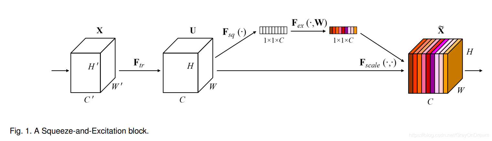

其中X是网络的输入，然后经过Ftr一系列卷积的操作，变为U，然后就输入给SEBlock，其中Ftr为一些列卷积操作的集合

SEBlock主要分为三个模块：Sequeeze、Excitation、Scale

Sequeeze：就是将U进行压缩，维度为1x1xC，也就是得到一个和通道数一样的一维向量作为每个通道的评价分数。作者认为传统的卷积操作过于集中于局部地区，而无法提取上下文关系（context），可以通过使用GAP(global average pooling)实现这一点来作用于每个通道上来进行通道选择。

Excitation：使用全连接神经网络，对 Sequeeze 之后的结果做一个非线性变换。这一步是利用具有非线性的Sigmoid激活函数保证非线性的前提下进行通道选择。

Scale：这部分就是将学习到的通道权重应用到原有的feature上去，就是各通道权重值分别和原特征图对应通道的二维矩阵分别相乘。

### SEBlock的插入

SEBlock可以作为子模块插入不同的网络，主要还是插入到backbone中。下面是不同网络实现的内容
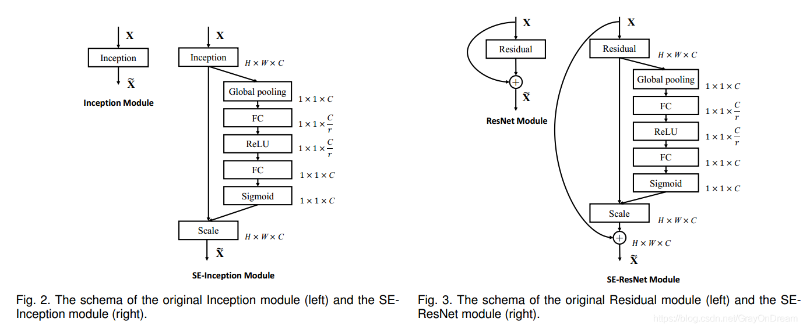

### 代码实现

```python
class SELayer(nn.Module):
    def __init__(self, channel, reduction=16):
        super(SELayer, self).__init__()
        self.avg_pool = nn.AdaptiveAvgPool2d(1)
        self.fc = nn.Sequential(
            nn.Linear(channel, channel // reduction, bias=False),
            nn.ReLU(inplace=True),
            nn.Linear(channel // reduction, channel, bias=False),
            nn.Sigmoid()
        )

    def forward(self, x):
        b, c, _, _ = x.size()
        y = self.avg_pool(x).view(b, c)
        y = self.fc(y).view(b, c, 1, 1)
        return x * y.expand_as(x)
```

### 实验内容

SEBlock的实现基本结构是sequeeze + fn1 + fn2 + excitation,然后原始输入和该结构得到的通道权重相乘即可，而不同分不同实现效果不同。这篇文章中也进行了消融实验，来证明 SE 模块的有效性，也说明了设置通道调整比例reduction=16 的原因。

- squeeze 方式：仅仅比较了 max 和 avg，发现 avg 要好一点。

- excitation 方式：使用了 ReLU,Tanh,Sigmoid，发现 Sigmoid 好。

- stage: resnet50 有不同的阶段，通过实验发现，将SE施加到所有的阶段效果最好。

- 集成策略：将SE放在残差单元的前部，后部还是平行于残差单元，最终发现，放到前部比较好。

- 不同的reduction，在具体实现中在sequeeze和excitation操作之间使用了两个全连接层先进行通道调整，这里用两个全连接层，因为一个全连接层无法同时应用relu和sigmoid两个非线性函数，但是两者又缺一不可。而这里的通道调整比例为r，不同的r取值效果如下：

  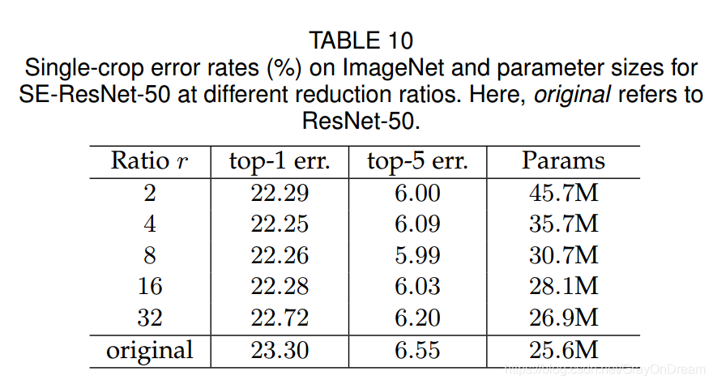

## CBAM（Convolutional Block Attention Module）

### CBAM结构

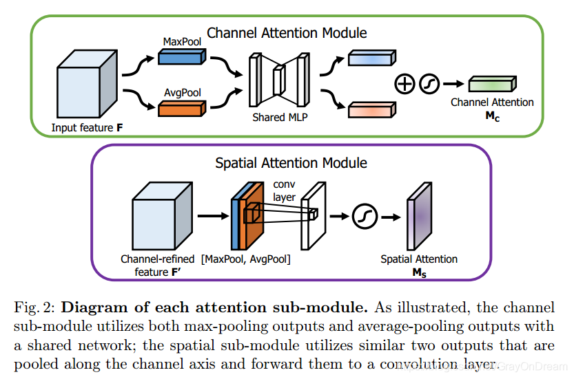

### **通道注意力模块**

通道注意力部分可以从图中看到基本和SEBlock相同，只是加了一个分支Maxpooling，中间共享一个mlp，以产生通道注意力图，最后将两部分的输出进行逐像素相加后，再经过sigmoid输出特征向量。

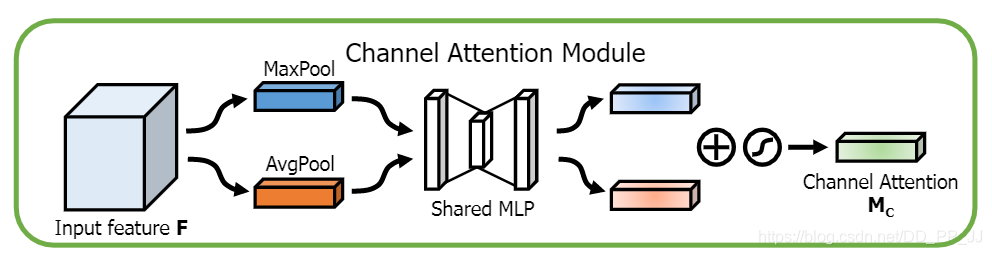

```python
class ChannelAttention(nn.Module):
    def __init__(self, in_planes, rotio=16):
        super(ChannelAttention, self).__init__()
        self.avg_pool = nn.AdaptiveAvgPool2d(1)
        self.max_pool = nn.AdaptiveMaxPool2d(1)

        self.sharedMLP = nn.Sequential(
            nn.Conv2d(in_planes, in_planes // ratio, 1, bias=False), nn.ReLU(),
            nn.Conv2d(in_planes // rotio, in_planes, 1, bias=False))
        self.sigmoid = nn.Sigmoid()

    def forward(self, x):
        avgout = self.sharedMLP(self.avg_pool(x))
        maxout = self.sharedMLP(self.max_pool(x))
        return self.sigmoid(avgout + maxout)
```

核心的部分 Shared MLP 使用了 1×1 卷积完成的，进行信息的提取。需要注意的是，其中的 bias 需要人工设置为 False。

### **空间注意力模块**

空间注意力的结构也是使用平均池化和最大池化，对输入特征图在通道层面上进行压缩操作，对输入特征分别在通道维度上做了平均池化和最大池化操作。不同的是，通道注意力的平均池化和最大池化是并行的，而这里是串行的。最后得到了两个二维的 feature，将其按通道维度拼接在一起得到一个通道数为2的特征图，之后使用一个包含单个卷积核层对其进行卷积操作，要保证最后得到的特征在空间的维度上与输入的特征图一致。

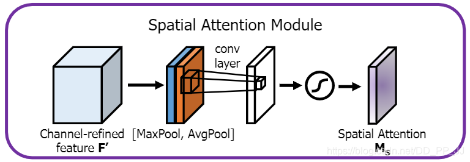

```python
class SpatialAttention(nn.Module):
    def __init__(self, kernel_size=7):
        super(SpatialAttention, self).__init__()
        assert kernel_size in (3,7), "kernel size must be 3 or 7"
        padding = 3 if kernel_size == 7 else 1

        self.conv = nn.Conv2d(2,1,kernel_size, padding=padding, bias=False)
        self.sigmoid = nn.Sigmoid()

    def forward(self, x):
        avgout = torch.mean(x, dim=1, keepdim=True)
        maxout, _ = torch.max(x, dim=1, keepdim=True)
        x = torch.cat([avgout, maxout], dim=1)
        x = self.conv(x)
        return self.sigmoid(x)
```

这个部分实现也很简单，分别从通道维度进行平均池化和最大池化，合并得到一个通道数为 2 的卷积层，连接起来生成一个有效的特征描述符，然后通过一个标准的卷积层连接和卷积混合, 产生我们的2D 空间注意图，得到了一个通道数为1的spatial attention。

### **模块组合**

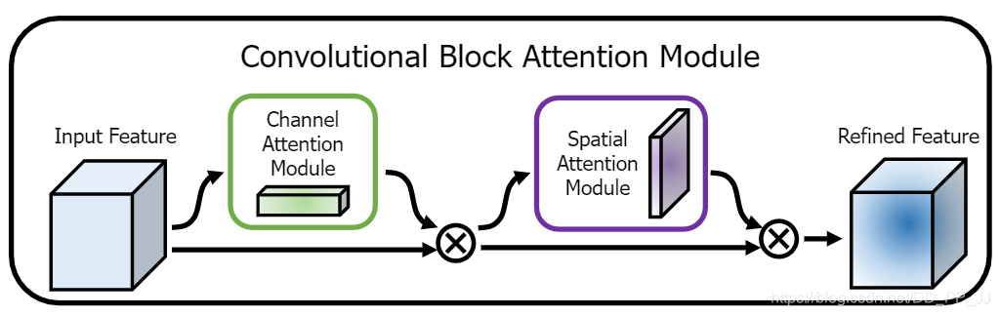

```python
class BasicBlock(nn.Module):
    expansion = 1
    
    def __init__(self, inplanes, planes, stride=1, downsample=None):
        super(BasicBlock, self).__init__()
        self.conv1 = conv3x3(inplanes, planes, stride)
        self.bn1 = nn.BatchNorm2d(planes)
        self.relu = nn.ReLU(inplace=True)
        self.conv2 = conv3x3(planes, planes)
        self.bn2 = nn.BatchNorm2d(planes)
        self.ca = ChannelAttention(planes)
        self.sa = SpatialAttention()
        self.downsample = downsample
        self.stride = stride
        
    def forward(self, x):
        residual = x
        out = self.conv1(x)
        out = self.bn1(out)
        out = self.relu(out)
        out = self.conv2(out)
        out = self.bn2(out)
        out = self.ca(out) * out  # 广播机制
        out = self.sa(out) * out  # 广播机制
        if self.downsample is not None:
            residual = self.downsample(x)
        out += residual
        out = self.relu(out)
        return out
```

最后的使用一个类进行两个模块的集成，得到的通道注意力和空间注意力以后，使用广播机制对原有的 feature map 进行信息提炼，最终得到提炼后的 feature map。以上代码以 ResNet 中的模块作为对象，实际运用可以单独将以下模块融合到网络中:

```python
 class cbam(nn.Module):
    def __init__(self, planes)：
        self.ca = ChannelAttention(planes)# planes是feature map的通道个数
        self.sa = SpatialAttention()
        
     def forward(self, x):
        x = self.ca(out) * x  # 广播机制
        x = self.sa(out) * x  # 广播机制
```

## BAM（Bottleneck Attention Module）

### BAM结构

BAM与CBAM很相似的起名，还是 CBAM 的团队完成的作品。CBAM 可以看做是通道注意力机制和空间注意力机制的串联（先通道后空间），BAM 可以看做两者的并联。

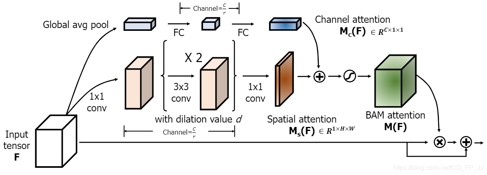

这个模块之所以叫 bottlenect 是因为这个模块放在 DownSample 也就是 pooling layer 之前。

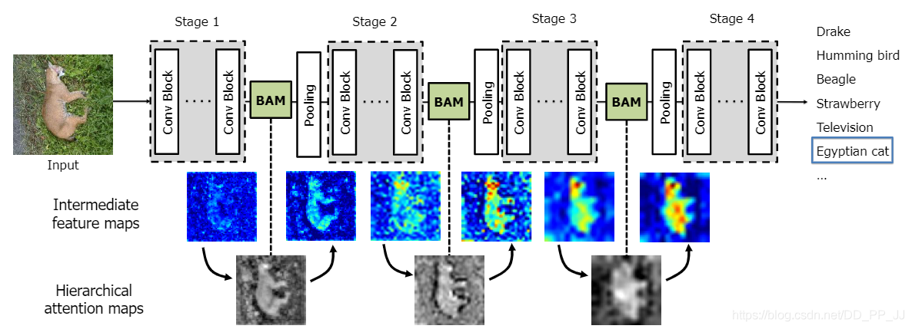

### **通道注意力模块**

```python
class Flatten(nn.Module):
    def forward(self, x):
        return x.view(x.size(0), -1)

class ChannelGate(nn.Module):
    def __init__(self, gate_channel, reduction_ratio=16, num_layers=1):
        super(ChannelGate, self).__init__()
        self.gate_c = nn.Sequential()
        self.gate_c.add_module('flatten', Flatten())

        gate_channels = [gate_channel]  # eg 64
        gate_channels += [gate_channel // reduction_ratio] * num_layers  # eg 4
        gate_channels += [gate_channel]  # 64
        # gate_channels: [64, 4, 4]

        for i in range(len(gate_channels) - 2):
            self.gate_c.add_module(
                'gate_c_fc_%d' % i,
                nn.Linear(gate_channels[i], gate_channels[i + 1]))
            self.gate_c.add_module('gate_c_bn_%d' % (i + 1),
                                   nn.BatchNorm1d(gate_channels[i + 1]))
            self.gate_c.add_module('gate_c_relu_%d' % (i + 1), nn.ReLU())

        self.gate_c.add_module('gate_c_fc_final',
                               nn.Linear(gate_channels[-2], gate_channels[-1]))

    def forward(self, x):
        avg_pool = F.avg_pool2d(x, x.size(2), stride=x.size(2))
        return self.gate_c(avg_pool).unsqueeze(2).unsqueeze(3).expand_as(x)
```

首先经过avg_pool2d进行处理，这里与AdaptiveAvgPool2d(1)的效果是一样的。然后经过 gate_c 模块，里边先经过 Flatten 将其变为 [batch size, channel] 形状的 tensor, 然后后边一大部分都是 Linear 模块，进行线性变换。最终按照输入 tensor x 的形状进行扩展，得到关于通道的注意力。

与 CBAM 中的 channel attention 的区别：

- CBAM 中使用的是先用 adaptiveAvgPooling，然后进行卷积实现的通道处理；BAM 使用的也是 adaptiveAvgPooling, 然后进行多个 Linear 线性变换，得到 channel attention。其实关于用 1×1 卷积和 Linear 层实现，在 feature map 尺寸为 1×1 的时候，两者从数学原理上讲，没有区别。
- CBAM 中激活函数使用 sigmoid， BAM 中的通道部分使用了 ReLU，还添加了 BN 层。

### **空间注意力模块**

这个空间分支产生了空间Attention去增强或者抑制特征在不同的空间位置，众所周知，利用上下文信息是去知道应该关注哪些位置的关键点。在这里我们为了高效性运用空洞卷积去增大感受野。并且与标准卷积相比，空洞卷积有助于构造更有效的spatial map。这里有两个超参数 dilation value 和reduction ratio。

d参数决定了感受野大小,这对空间分支聚合上下文信息非常重要，r参数决定了通道分支和空间分支的压缩比例。空洞卷积的加入可以增大感受野，而引入压缩比可以增加编码的内涵，减少计算量。这里设置d=4，r=16。

这里采用空洞卷积来高效扩大感受野，观察到空洞卷积有助于构建比标准卷积更有效的空间映射，并且空间分支采用了ResNet建议的“瓶颈结构”，既节省了参数数量又节省了计算开销。

```python
class SpatialGate(nn.Module):
    def __init__(self,
                 gate_channel,
                 reduction_ratio=16,
                 dilation_conv_num=2,
                 dilation_val=4):
        super(SpatialGate, self).__init__()
        self.gate_s = nn.Sequential()

        self.gate_s.add_module(
            'gate_s_conv_reduce0',
            nn.Conv2d(gate_channel,
                      gate_channel // reduction_ratio,
                      kernel_size=1))
        self.gate_s.add_module('gate_s_bn_reduce0',
                               nn.BatchNorm2d(gate_channel // reduction_ratio))
        self.gate_s.add_module('gate_s_relu_reduce0', nn.ReLU())

        # 进行多个空洞卷积，丰富感受野
        for i in range(dilation_conv_num):
            self.gate_s.add_module(
                'gate_s_conv_di_%d' % i,
                nn.Conv2d(gate_channel // reduction_ratio,
                          gate_channel // reduction_ratio,
                          kernel_size=3,
                          padding=dilation_val,
                          dilation=dilation_val))
            self.gate_s.add_module(
                'gate_s_bn_di_%d' % i,
                nn.BatchNorm2d(gate_channel // reduction_ratio))
            self.gate_s.add_module('gate_s_relu_di_%d' % i, nn.ReLU())

        self.gate_s.add_module(
            'gate_s_conv_final',
            nn.Conv2d(gate_channel // reduction_ratio, 1, kernel_size=1))

    def forward(self, x):
        return self.gate_s(x).expand_as(x)
```

- 先经过一个 conv+bn+relu 模块，通道缩进，信息进行压缩。
- 然后经过了多个 dilated conv+bn+relu 模块，空洞率设置为 4（默认）。
- 最后经过一个卷积，将通道压缩到 1。
- 最终将其扩展为 tensor x 的形状。

与CBAM的区别在于：

- CBAM 中通过通道间的 max,avg 处理成通道数为 2 的 feature, 然后通过卷积 + Sigmoid 得到最终的 map
- BAM 中则全部通过卷积或者空洞卷积完成信息处理，计算量更大一点, 但是融合了多感受野，信息更加丰富。

### **模块组合**

```python
class BAM(nn.Module):
    def __init__(self, gate_channel):
        super(BAM, self).__init__()
        self.channel_att = ChannelGate(gate_channel)
        self.spatial_att = SpatialGate(gate_channel)

    def forward(self, x):
        att = 1 + F.sigmoid(self.channel_att(x) * self.spatial_att(x))
        return att * x
```

最终融合通过两者是相乘，并且使用了 sigmoid 进行归一化。

## Dual Attention Network中的PAM和CAM

Dual Attention Network使用一种新的框架，称为双注意网络（DANet），用于自然场景图像分割。Dual Attention Network包含两种注意力模块，PAM和CAM，PAM是空间注意力模块，而CAM是通道注意力模块。这里通过两个并行的attention module分别捕获spatial和channel的依赖性，最后整合两个attention module的输出得到更好的特征表达。

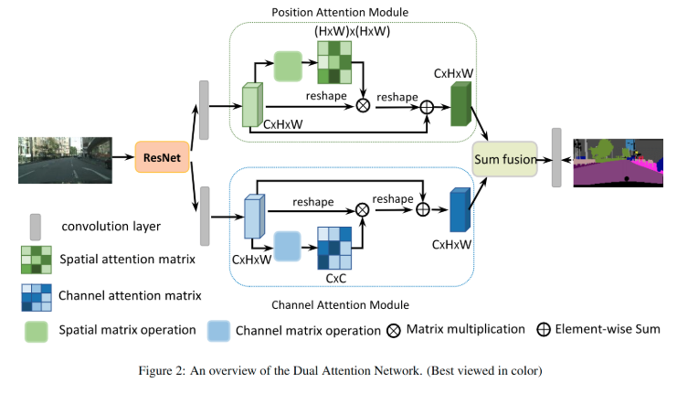

### **空间注意力模块（Channel Attention Module）**

捕获特征图的任意两个位置之间的空间依赖，对于某个特定的特征，被所有位置上的特征加权和更新。权重为相应的两个位置之间的特征相似性。因此，任何两个现有相似特征的位置可以相互贡献提升，而不管它们之间的距离。 为了在局部特征表示之上建模丰富的上下文关系，我们引入了一个位置注意力模块。位置注意力模块将更广泛的上下文信息编码到局部特征中，从而增强其表示能力。

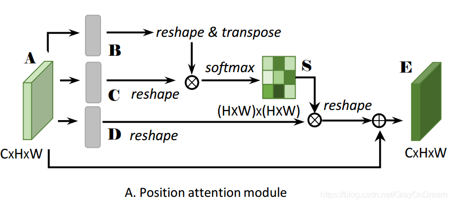

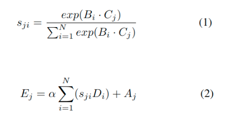

途中PAM分为四个分支，其中生成Attention的上BC两个分支，D用来生成经过attention map处理的feature，最下面的是保留原有的feature保证信息不丢失。

- 首先输入A，经过conv+batch_norm+relu得到BCD三个分支。
- 然后BC通过reshape变成CxN的矩阵，其中N=HxW，C为通道数
- B转置后与C相乘，再通过softmax运算，输出两张特征图上i对于j的影响权重
- 得到的attention map的S和输入D进行相乘的操作
- 最后上面的最后输出reshape回原来的形状，继续和原来的输入A进行加权的相加，这里的加权系数α初始化为0，是可学习的。

```python
class PAM_Module(Module):
    """ Position attention module"""
    #Ref from SAGAN
    def __init__(self, in_dim):
        super(PAM_Module, self).__init__()
        self.chanel_in = in_dim

        self.query_conv = Conv2d(in_channels=in_dim, out_channels=in_dim//8, kernel_size=1)
        self.key_conv = Conv2d(in_channels=in_dim, out_channels=in_dim//8, kernel_size=1)
        self.value_conv = Conv2d(in_channels=in_dim, out_channels=in_dim, kernel_size=1)
        self.gamma = Parameter(torch.zeros(1))

        self.softmax = Softmax(dim=-1)
    def forward(self, x):
        """
            inputs :
                x : input feature maps( B X C X H X W)
            returns :
                out : attention value + input feature
                attention: B X (HxW) X (HxW)
        """
        m_batchsize, C, height, width = x.size()
        proj_query = self.query_conv(x).view(m_batchsize, -1, width*height).permute(0, 2, 1)
        proj_key = self.key_conv(x).view(m_batchsize, -1, width*height)
        energy = torch.bmm(proj_query, proj_key)
        attention = self.softmax(energy)
        proj_value = self.value_conv(x).view(m_batchsize, -1, width*height)

        out = torch.bmm(proj_value, attention.permute(0, 2, 1))
        out = out.view(m_batchsize, C, height, width)

        out = self.gamma*out + x
        return out
```

### **通道注意力模块（Position Attention Module）**

每个高层次特征的通道映射都可以看作是一个特定于类的响应，不同的语义响应相互关联。通过探索通道映射之间的相互依赖关系，可以强调相互依赖的特征映射，提高特定语义的特征表示。

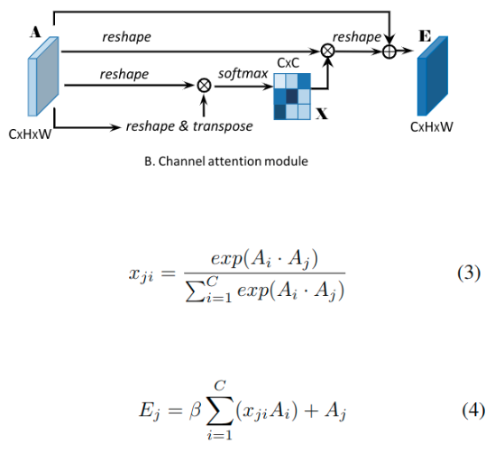

- 在Channel Attention Module中，分别对A做reshape和reshape与transpose；
- 将得到的两个特征图相乘再通过softmax得到channel attention map X (C×C)；
- X与A做乘积再乘以尺度系数β再reshape为原来形状，最后与A相加得到最后的输出E。 其中β初始化为0，并逐渐的学习分配到更大的权重。

```python
class CAM_Module(Module):
    """ Channel attention module"""
    def __init__(self, in_dim):
        super(CAM_Module, self).__init__()
        self.chanel_in = in_dim
        self.gamma = Parameter(torch.zeros(1))
        self.softmax  = Softmax(dim=-1)
        
    def forward(self,x):
        """
            inputs :
                x : input feature maps( B X C X H X W)
            returns :
                out : attention value + input feature
                attention: B X C X C
        """
        m_batchsize, C, height, width = x.size()
        proj_query = x.view(m_batchsize, C, -1)
        proj_key = x.view(m_batchsize, C, -1).permute(0, 2, 1)
        energy = torch.bmm(proj_query, proj_key)
        energy_new = torch.max(energy, -1, keepdim=True)[0].expand_as(energy)-energy
        attention = self.softmax(energy_new)
        proj_value = x.view(m_batchsize, C, -1)

        out = torch.bmm(attention, proj_value)
        out = out.view(m_batchsize, C, height, width)

        out = self.gamma*out + x
        return out
```

## Non-local

Non-Local 是王小龙在 CVPR2018 年提出的一个自注意力模型。Non-Local Neural Network 和 Non-Local Means 非局部均值去燥滤波有点相似的感觉。普通的滤波都是 3×3 的卷积核，然后在整个图片上进行移动，处理的是 3×3 局部的信息。Non-Local Means 操作则是结合了一个比较大的搜索范围，并进行加权。

在 Non-Local NN 这篇文章中的 Local 也与以上有一定关系，主要是针对感受野来说的，一般的卷积的感受野都是 3×3 或 5×5 的大小，而使用 Non-Local 可以让感受野很大，而不是局限于一个局部领域。

### 流程

Non-local 的通用公式表示：yi=1C(x)∑∀jf(xi,xj)g(xj)

- x 是输入信号，cv 中使用的一般是 feature map
- i 代表的是输出位置，如空间、时间或者时空的索引，他的响应应该对 j 进行枚举然后计算得到的
- f 函数式计算 i 和 j 的相似度
- g 函数计算 feature map 在 j 位置的表示
- 最终的 y 是通过响应因子 C(x) 进行标准化处理以后得到的
- i 代表的是当前位置的响应，j 代表全局响应，通过加权得到一个非局部的响应值。

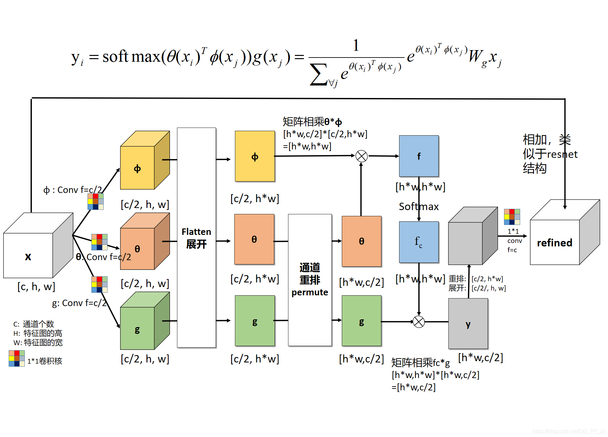

- x 代表 feature map, xi代表的是当前关注位置的信息； xj代表的是全局信息。
- θ代表的是θ(xi)=Wθxi , 实际操作是用一个 1×1 卷积进行学习的。
- φ代表的是ϕ(xj)=Wϕxj, 实际操作是用一个 1×1 卷积进行学习的。
- g 函数意义同上。
- C(x) 代表的是归一化操作，在 embedding gaussian 中使用的是 Sigmoid 实现的。

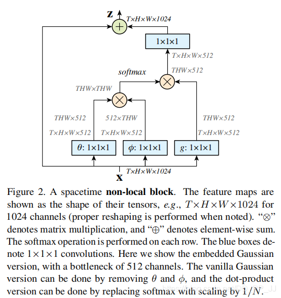

X 是一个 feature map, 形状为 [bs, c, h, w], 经过三个 1×1 卷积核，将通道缩减为原来一半（c/2）。

然后将 h,w 两个维度进行 flatten，变为 h×w，最终形状为[bs, c/2, h×w] 的 tensor。之后

对θ对应的 tensor 进行通道重排，在线性代数中也就是转置，得到形状为 [bs, h×w, c/2]。

然后与φ代表的 tensor 进行矩阵乘法，得到一个形状为[bs, h×w，h×w] 的矩阵，这个矩阵计算的是相似度（或者理解为 attention）。

然后经过 softmax 进行归一化，然后将该得到的矩阵fcfc 与 g 经过 flatten 和转置的结果进行矩阵相乘，得到的形状为 [bs, h*w, c/2] 的结果 y。

然后转置为 [bs, c/2, h×w] 的 tensor, 然后将 h×w 维度重新伸展为 [h, w]，从而得到了形状为[bs, c/2, h, w] 的 tensor。

然后对这个 tensor 再使用一个 1×1 卷积核，将通道扩展为原来的 c，这样得到了 [bs, c, h, w] 的 tensor, 与初始 X 的形状是一致的。

最终一步操作是将 X 与得到的 tensor 进行相加(类似 resnet 中的 residual block)。

### 优点

- 提出的 non-local operations 通过计算任意两个位置之间的交互直接捕捉远程依赖，而不用局限于相邻点，其相当于构造了一个和特征图谱尺寸一样大的卷积核, 从而可以维持更多信息。
- non-local 可以作为一个组件，和其它网络结构结合，经过作者实验，证明了其可以应用于图像分类、目标检测、目标分割、姿态识别等视觉任务中，并且效果有不同程度的提升。
- Non-local 在视频分类上效果很好，在视频分类的任务中效果可观。

### 代码实现

```python
import torch
from torch import nn
from torch.nn import functional as F


class _NonLocalBlockND(nn.Module):
    """
    调用过程
    NONLocalBlock2D(in_channels=32),
    super(NONLocalBlock2D, self).__init__(in_channels,
            inter_channels=inter_channels,
            dimension=2, sub_sample=sub_sample,
            bn_layer=bn_layer)
    """
    def __init__(self,
                 in_channels,
                 inter_channels=None,
                 dimension=3,
                 sub_sample=True,
                 bn_layer=True):
        super(_NonLocalBlockND, self).__init__()

        assert dimension in [1, 2, 3]

        self.dimension = dimension
        self.sub_sample = sub_sample

        self.in_channels = in_channels
        self.inter_channels = inter_channels

        if self.inter_channels is None:
            self.inter_channels = in_channels // 2
            # 进行压缩得到channel个数
            if self.inter_channels == 0:
                self.inter_channels = 1

        if dimension == 3:
            conv_nd = nn.Conv3d
            max_pool_layer = nn.MaxPool3d(kernel_size=(1, 2, 2))
            bn = nn.BatchNorm3d
        elif dimension == 2:
            conv_nd = nn.Conv2d
            max_pool_layer = nn.MaxPool2d(kernel_size=(2, 2))
            bn = nn.BatchNorm2d
        else:
            conv_nd = nn.Conv1d
            max_pool_layer = nn.MaxPool1d(kernel_size=(2))
            bn = nn.BatchNorm1d

        self.g = conv_nd(in_channels=self.in_channels,
                         out_channels=self.inter_channels,
                         kernel_size=1,
                         stride=1,
                         padding=0)

        if bn_layer:
            self.W = nn.Sequential(
                conv_nd(in_channels=self.inter_channels,
                        out_channels=self.in_channels,
                        kernel_size=1,
                        stride=1,
                        padding=0), bn(self.in_channels))
            nn.init.constant_(self.W[1].weight, 0)
            nn.init.constant_(self.W[1].bias, 0)
        else:
            self.W = conv_nd(in_channels=self.inter_channels,
                             out_channels=self.in_channels,
                             kernel_size=1,
                             stride=1,
                             padding=0)
            nn.init.constant_(self.W.weight, 0)
            nn.init.constant_(self.W.bias, 0)

        self.theta = conv_nd(in_channels=self.in_channels,
                             out_channels=self.inter_channels,
                             kernel_size=1,
                             stride=1,
                             padding=0)
        self.phi = conv_nd(in_channels=self.in_channels,
                           out_channels=self.inter_channels,
                           kernel_size=1,
                           stride=1,
                           padding=0)

        if sub_sample:
            self.g = nn.Sequential(self.g, max_pool_layer)
            self.phi = nn.Sequential(self.phi, max_pool_layer)

    def forward(self, x):
        '''
        :param x: (b, c,  h, w)
        :return:
        '''

        batch_size = x.size(0)

        g_x = self.g(x).view(batch_size, self.inter_channels, -1)#[bs, c, w*h]
        g_x = g_x.permute(0, 2, 1)

        theta_x = self.theta(x).view(batch_size, self.inter_channels, -1)
        theta_x = theta_x.permute(0, 2, 1)

        phi_x = self.phi(x).view(batch_size, self.inter_channels, -1)

        f = torch.matmul(theta_x, phi_x)

        print(f.shape)

        f_div_C = F.softmax(f, dim=-1)

        y = torch.matmul(f_div_C, g_x)
        y = y.permute(0, 2, 1).contiguous()
        y = y.view(batch_size, self.inter_channels, *x.size()[2:])
        W_y = self.W(y)
        z = W_y + x
        return z
```