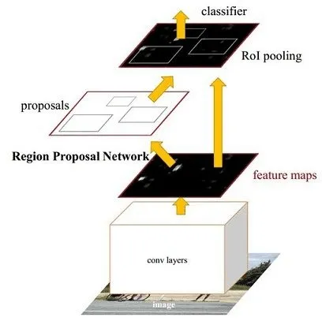
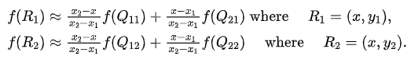
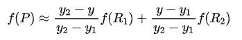
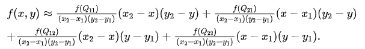
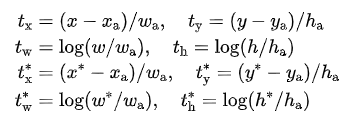
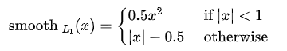

### **目标检测篇**

#### 传统目标检测基本流程

1. 使用不同尺度的滑动窗口选定图像的某一区域为候选区域（区域选择）；
2. 从对应的候选区域提取如Harr HOG LBP LTP等一类或者多类特征（特征提取）；
3. 使用Adaboost SVM 等分类算法对对应的候选区域进行分类，判断是否属于待检测的目标（分类器）。
4. 缺点1：基于滑动窗口的区域选择策略没有针对性，时间复杂度高，窗口冗余

1. 缺点2：手工设计的特征对于多样性的变化没有很好的鲁棒性

#### 简要阐述一下One-Stage、Two-Stage模型

- **One-Stage检测算法**：
  - 没有selective search产生region proposal的阶段，直接产生物体的类别概率和位置坐标，经过单次检测即可直接获得最终的检测结果。相比Two-Stage有更快的速度。
  - 代表网络有YOLO，SSD，RetinaNet

- **Two-Stage检测算法**：
  - 将检测问题划分成两个阶段，首先是获取region proposal进行位置精修和分类阶段。相比于One-Stage,精度高，漏检率也低，因为roi pooling会对目标做resize, 小目标的特征被放大，因此其特征轮廓也更为清晰，因此检测也更为准确。
  - 代表网络有Fast RCNN，Faster RCNN

- **Two-Stage和One-Stage的异同**
  - Two-Stage先对前景背景做了筛选，再进行回归，回归效果比较好，准度高但是相比较慢
  - One-Stage是直接对特征上的点进行直接回归，优点是速度快，缺点是因为正负样本失衡导致效果较差，要结合难例挖掘。
    - one stage在哪些具体方面检测精度不高：如果所有的anchor都没有覆盖到这个目标，那么这个目标就会漏检。

#### 目标检测优化的方向

- 从数据集下手，提升特征表征强度
- 从backbone下手，加深加宽或者换卷积方式
- 从RPN下手，比如级联，FPN，IOU NET
- 从损失函数下手，行人检测领域有些问题，如重叠，可以靠修改loss提升准确度

#### Faster RCNN原理介绍，要详细画出图



Faster R-CNN是一种两阶段（two-stage）方法,它提出的RPN网络取代了选择性搜索（selective search)算法后使检测任务可以由神经网络端到端地完成。在结构上，Faster RCNN将特征提取、候选区域提取，边框回归、以及分类都整合在了一个网络中。

#### RPN（Region Proposal Network）

- **RPN网络的作用：**
  - RPN专门用来提取候选框，一方面RPN耗时少，另一方面RPN可以很容易结合到Fast RCNN中，成为一个整体。

- **RPN网络的实现细节**：
  -  经backbone提取特征后的公共特征图，再经过sliding window处理，得到256维的特征。
  - 之后对每个特征向量做两次全连接操作，一个得到2个分数，分别为是背景的概率以及前景的概率；一个得到4个坐标，是针对原图的偏移，记住是原图。
  - 然后通过两次全连接得到结果2k个分数和4k个坐标，这里的k指的是由锚点产生的K个anchor框
  - 预先设定好共有9种组合，所以k等于9，最后我们的结果是针对这9种组合的，所以有H x W x 9个结果，也就是18个分数和36个坐标。

.webp)

#### **RPN的损失函数**

- **二分类损失+SmoothL1损失**
  - 训练RPN网络时，对于每个锚点都会定义一个二分类标签，表示是否包含物体：是或不是
  - 以下两种情况我们视锚点为了一个正样本标签时：
    - 锚点和锚点们与标注之间的最高重叠矩形区域
    - 或者锚点和标注的重叠区域指标（IOU）>0.7
  - RPN损失中的回归损失部分是通过计算偏移量而不是坐标以及宽高

.webp)


#### **介绍Faster R-CNN和Cascade R-CNN**

Faster-RCNN是基于候选区域的双阶段检测器代表作，总的来说可以分为四部分：首先是主干卷积网络的特征提取，然后是RPN层，RPN层通过softmax判断anchors属于positive或者negative，再利用边框回归修正anchors获得精确的候选区域，RPN生成了大量的候选区域，这些候选区域和feature maps一起送入ROI pooling中，得到了候选特征区域，最后送入分类层中进行类别判断和边框回归，得到最终的预测结果。

Cascade R-CNN算法是在Faster R-CNN上的改进，通过级联几个检测网络达到不断优化预测结果的目的，预普通的级联不同，Cascade R-CNN的几个检测网络是基于不同的IOU阈值确定的正负样本上训练得到的。简单来说cascade R-CNN是由一系列的检测模型组成，每个检测模型都基于不同IOU阈值的正负样本训练得到，前一个检测模型的输出作为后一个检测模型的输入，因此是stage by stage的训练方式，而且越往后的检测模型，其界定正负样本的IOU阈值是不断上升的。

.webp)

#### anchor box

- 滑窗的中心在原像素空间的映射点称为anchor，以此anchor为中心，生成k个proposals。paper中默认k=9, 其中有三种尺度，每种尺度三种宽高比的比例。使用不同尺寸、不同宽高比是为了得到更大的交并比。

- 提出anchor box主要有两个原因：
  - 一个窗口只能检测一个目标
  - 无法解决多尺度问题。

- 目前anchor box尺寸的选择主要有三种方式：
  - 人为经验选取
  - k-means聚类
  - 作为超参数进行学习

#### RoI Pooling

- RoI Pooling的过程就是将一个个大小不同的box矩形框，都映射成大小固定的矩形框，**具体操作：**
  - 根据输入image，将ROI映射到feature map对应位置
  - 将映射后的区域划分为相同大小的部分section，注意这里section的数量与输出的维度相同
  - 对每个section进行最大池化操作
  - 输出的feature maps的大小不取决于ROI和卷积feature maps大小。ROI pooling 最大的好处就在于极大地提高了处理速度。
- 优缺点
  - **优点：** 
    - 1.允许对CNN中的特征图进行重利用；
    - 2.可以显著加速训练、推理的速度；
    - 3.允许以端到端的形式训练目标检测任务。
  - **缺点：** 
    - 由于 RoIPooling 采用的是最近邻插值（即INTER_NEAREST） ，在resize时，对于缩放后坐标不能刚好为整数的情况，采用了粗暴的舍去小数，相当于选取离目标点最近的点，损失一定的空间精度。因为region proposal的xywh通常是小数，但是为了方便操作会把它整数化。将整数化后的边界区域平均分割成 k x k 个单元，对每一个单元边界进行整数化。经过上述两次整数化，此时的候选框已经和最开始回归出来的位置有一定的偏差，这个偏差会影响检测或者分割的准确度

#### **映射规则** 

- 映射规则比较简单，就是把各个坐标除以“输入图片与feature map的大小的比值”

#### **ROI Pooling与ROI Align(Mask R-CNN)的区别**

- ROI Align的思路很简单：取消量化操作，使用双线性内插的方法获得坐标为浮点数的像素点上的图像数值,从而将整个特征聚集过程转化为一个连续的操作
  - 遍历每一个候选区域，保持浮点数边界不做量化。
  - 将候选区域分割成k x k个单元，每个单元的边界也不做量化。
  - 在每个单元中计算固定四个坐标位置，用双线性内插的方法计算出这四个位置的值，然后进行最大池化操作。
  - ROI Align舍去了近似像素取整数的量化方法，改用双线性插值的方法确定特征图坐标对应于原图中的像素位置.ROI Align很好地解决了ROI Pooling操作中两次量化造成的区域不匹配(mis-alignment)的问题。
  - 对于检测图片中大目标物体时，两种方案的差别不大，而如果是图片中有较多小目标物体需要检测，则优先选择RoiAlign，更精准些。

#### **RoI Align中双线性插值计算像素值的具体方法**

在数学上，双线性插值是有两个变量的插值函数的线性插值扩展，其核心思想是在两个方向分别进行一次线性插值。

.webp)

假如我们想得到未知函数 f 在点 P = (x, y) 的值，假设我们已知函数 f 在 Q11 = (x1, y1)、Q12 = (x1, y2), Q21 = (x2, y1) 以及 Q22 = (x2, y2) 四个点的值。最常见的情况，f就是一个像素点的像素值。首先在 x 方向进行线性插值，得到



然后在 y 方向进行线性插值，得到



综合起来就是双线性插值最后的结果：



由于图像双线性插值只会用相邻的4个点，因此上述公式的分母都是1。

每个采样点的特征值由其相邻的4个整型特征点的像素值通过双线性差值得到。

最近邻插值法(图像的内插):在原图中最近得像素点赋值给新的像素点

#### 非极大值抑制（non maximum suppression）

- 本质是搜索局部极大值，抑制非极大值元素。非极大值抑制，主要就是用来抑制检测时冗余的框。
- **大致算法流程**为：
  - 对所有预测框的置信度降序排序
  - 选出置信度最高的预测框，确认其为正确预测，并计算他与其他预测框的IOU
  - 根据2中计算的IOU去除重叠度高的，IOU>threshold阈值就删除
  - 剩下的预测框返回第1步，直到没有剩下的为止
  - nms一次处理只一个类别，如果有N个类别，那么就需要执行N次。

#### SoftNMS

当两个目标靠的非常近时，置信度低的会被置信度高的框抑制掉，从而两个目标靠的非常近时会被识别成一个bbox。为了解决这个问题，可以使用softNMS（**基本思想**：用稍低一点的分数来代替原有的分数，而不是直接置零）

#### Faster R-CNN是如何解决正负样本不平衡的问题？

限制正负样本比例为1:1，如果正样本不足，就用负样本补充，这种方法后面研究工作用的不多。

通常针对类别不平衡问题可以从调整样本数或修改loss weight两方面去解决，常用的方法有OHEM、OHNM、class balanced loss和Focal loss。

#### **Faster RCNN怎么筛选正负anchor**

我们给两种锚点分配一个正标签：

1. 具有与实际边界框的重叠最高交并比（IOU）的锚点，
2. 具有与实际边界框的重叠超过0.7 IOU的锚点。
3. IOU比率低于0.3，我们给非正面的锚点分配一个负标签。

#### Faster RCNN中bbox回归用的是什么公式，说一下该网络是怎么回归bbox的？



其中x,y,w,h分别为bbox的中心点坐标，宽与高。分别是预测box、anchor box、真实box。

前两行是预测的box关于anchor的offset与scales，后两行是真实box与anchor的offset与scales。那回归的目的很明显，即使ti,ti*尽可能相近。回归损失函数利用的是Fast-RCNN中定义的smooth L1函数，对外点更不敏感：




损失函数优化权重W，使得测试时bbox经过W运算后可以得到一个较好的偏移量与尺度，利用这个平移量与尺度可在原预测bbox上微调，得到更好的预测结果。

#### 简述Faster RCNN的前向计算过程

- 输入一张待检测图片
- vgg16网络conv layers提取整张图片的特征，输出feature map分别输入到RPN和Fast RCNN网络开头
- RPN网络得出region proposal，将这些候选框信息送入到Fast RCNN网络开头
- 利用候选框在之前送到的feature map提取特征，并通过ROI Pooling层得到规定大小的feature map
- 将这些feature map送入Fast RCNN网络中进行分类和回归坐标，最终得到需检测物体的坐标

#### **简述Faster RCNN训练步骤**

- 训练RPN，该网络用ImageNet预训练的模型初始化，并端到端微调，用于生成region proposal；
- 训练Fast R-CNN，由imageNet model初始化，利用第一步的RPN生成的region proposals作为输入数据，训练Fast R-CNN一个单独的检测网络，这时候两个网络还没有共享卷积层；
- 调优RPN，用第二步的fast-rcnn model初始化RPN再次进行训练，但固定共享的卷积层，并且只微调RPN独有的层，现在两个网络共享卷积层了；
- 调优Fast R-CNN,由第三步的RPN model初始化fast-RCNN网络，输入数据为第三步生成的proposals。保持共享的卷积层固定，微调Fast R-CNN的fc层。这样，两个网络共享相同的卷积层，构成一个统一的网络。

#### Faster RCNN有什么不足的地方吗？如何改进？

1. 可以使用更好的特征网络ResNet等；

2. 可以使用更精确的RPN：可以使用FPN网络架构来设计RPN网络

3. 可以使用更好的ROI分类方法：比如ROI分别在conv4和conv5上做ROI-Pooling，合并后再进行分类，这样基本不增加计算量，又能利用更高分辨率的conv4

4. 可以使用使用SoftNMS代替NMS

#### YOLO系列

YOLO系列算法是一类典型的one-stage目标检测算法，其利用anchor box将分类与目标定位的回归问题结合起来，从而做到了高效、灵活和泛化性能好。YOLO也是单阶段检测算法的开山之作，最初的yolov1是在图像分类网络的基础上直接进行的改进，摒弃了二阶段检测算法中的RPN操作，直接对输入图像进行分类预测和回归，所以它相对于二阶段的目标检测算法而言，速度非常的快，但是精度会低很多；但是在迭代到目前的V4、V5版本后，yolo的精度已经可以媲美甚至超过二阶段的目标检测算法，同时保持着非常快的速度，是目前工业界内最受欢迎的算法之一。yolo的核心思想是将输入的图像经过backbone特征提取后，将的到的特征图划分为S x S的网格，物体的中心落在哪一个网格内，这个网格就负责预测该物体的置信度、类别以及坐标位置。

**YOLOv1：**

- YOLOv1的核心思想就是利用整张图作为网络的输入，直接在输出层回归 bounding box（边界框） 的位置及其所属的类别。
- 将图像划分为7x7的网格，如果某个物体的中心落在这个网格中，那么这个网格就负责预测这个物体
- 没有anchor的概念
- 然后每个网格预测两个边框，即预测出7x7x2个窗口
- 在VOC数据集上，预测位置（xywh）+置信度以及类别，所以输出为7x7x(5+5+20)
- 根据阈值使用nms过滤冗余的
- 但是每个格子只会选择出iou最高的那个目标，所以如果每个格子包含多个物体，就只能检测出其中一个
- 输出层为全连接层
- 损失函数：三个损失函数都使用误差平方和
- 群体小目标检测效果差
- 出现新尺寸的目标时，效果差，原因是没有使用anchor导致定位不准确
- **创新点**：
  - 将整张图作为网络的输入，直接在输出层回归bounding box的位置和所属的类别
  - 速度快，one stage detection的开山之作
- **损失函数设计细节**：
  - YOLOv1对位置坐标误差，IoU误差，分类误差均使用了均方差作为损失函数
  - 激活函数：最后一层全连接层用线性激活函数，其余层采用leak RELU
- **缺点：**
  - 首先，每个单元格只预测2个bbox，然后每个单元格最后只取与gt_bbox的IOU高的那个最为最后的检测框，也只是说每个单元格最多只预测一个目标。
  - 损失函数中，大物体 IOU 误差和小物体 IOU 误差对网络训练中 loss 贡献值接近（虽然采用求平方根方式，但没有根本解决问题）。因此，对于小物体，小的 IOU 误差也会对网络优化过程造成很大的影响，从而降低了物体检测的定位准确性。
  - 由于输出层为全连接层，因此在检测时，YOLO 训练模型只支持与训练图像相同的输入分辨率的图片。
  - 和two-stage方法相比，没有region proposal阶段，召回率较低

**YOLOv2：**

- YOLOv2又叫YOLO9000，因为使用了VOC数据集以及Imagenet数据集联合训练，可以检测9000个类别
- 联合使用coco物体检测标注数据和imagenet物体分类标注数据训练物体检测模型。
- 使用了更高的分辨率，训练backbone的时候从224x224到448x448
- 使用Darknet19骨架训练
- 多尺度训练，每迭代10个batch，随机更换尺寸320、352...608，都为32的倍数
- 引入了faster rcnn中anchor box的思想，对网络结构的设计进行了改进，基于Kmeans的聚类方法自动提取先验框的信息，可根据不同的数据集设置Anchor
- 每个Anchor预测5个Boundingbox，所以输出5x(5+20)，坐标、置信度+类别
- 输出层使用卷积层替代YOLO的全连接层
- 使用了Passthrough，类似Pixel-shuffle，融合高层和低层的信息，更好检测小物体
- 采用了BN层，并且去掉了全连接层，最后添加了3个1024x3x3维度的卷积层，最后再使用1x1卷积来预测目标，输出的个数为上面的125个

- **创新点**：
  - Anchor: 引入了Faster R-CNN中使用的Anchor，作者通过在所有训练图像的所有边界框上运行k-means聚类来选择锚的个数和形状，默认k = 5，因此它找到五个最常见的目标形状。
    - anchor设置的意义：其实就是多尺度的滑动窗口
  - 修改了网络结构，去掉了全连接层，改成了全卷积结构。
  - 使用Batch Normalization可以从model中去掉Dropout，而不会产生过拟合。
  - 训练时引入了世界树（WordTree）结构，将检测和分类问题做成了一个统一的框架，并且提出了一种层次性联合训练方法，将ImageNet分类数据集和COCO检测数据集同时对模型训练。

**YOLOv3：**

yolov3采用了作者自己设计的darknet53作为主干网络，darknet53借鉴了残差网络的思想，与resnet101、resnet152相比，在精度上差不多的同时，有着更快的速度，网络里使用了大量的残差跳层连接，并且抛弃了pooling池化操作，直接使用步长为2的卷积来实现下采样。在特征融合方面，为了加强小目标的检测，引入了类似与FPN的多尺度特征融合，特征图在经过上采样后与前面层的输出进行concat操作，浅层特征和深层特征的融合，使得yolov3在小目标的精度上有了很大的提升。yolov3的输出分为三个部分，首先是置信度、然后是坐标信息，最后是分类信息。在推理的时候，特征图会等分成S x S的网格，通过设置置信度阈值对格子进行筛选，如果某个格子上存在目标，那么这个格子就负责预测该物体的置信度、坐标和类别信息。

.jpg)

- YOLOv3总结了自己在YOLOv2的基础上做的一些尝试性改进，有的尝试取得了成功，而有的尝试并没有提升模型性能。其中有两个值得一提的亮点，一个是使用残差模型，进一步加深了网络结构；另一个是使用FPN架构实现多尺度检测。
- Darknet-53，类似Resnet结构,堆叠残差结构，没有最大池化层，下采样通过两个步长的卷积操作完成，全部由卷积搭建而成（全卷积网络）
- 基本部件：卷积+BN+Leaky relu、残差结构res_unit
- 多尺度预测，采用类似FPN融合的方式，在三个不同尺寸大小的特征层上预测不同尺度信息，每个特征层三种尺度，所以最后为9个，从YOLOv2的5个变成9个
- 大目标输出维度：13x13x255，其中255=（80+5）×3；中目标输出维度：26×26×255；小目标输出维度：52×52×255
- 正负样本匹配：如何重合度高但不是最高的，则依旧抛弃。只选取重合度最高的
- 损失函数：置信度损失使用的是BCE、类别损失也是使用BCE、定位损失使用差值平方损失
- 分类器损失采用binary cross-entropy loss(二分类交叉损失熵) 而不是使用softmax，因为有的目标可能存在重叠的类别标签（多标签分类）：SUV又是车又是SUV，而softmax只会输出最大的类别。

- **创新点**：
  - 多尺度预测 ，类似FPN：每种尺度预测3个box, anchor的设计方式仍然使用聚类，得到9个聚类中心。
  - 更好的基础分类网络（类ResNet）和分类器 darknet-53。
  - 用逻辑回归替代softmax作为分类器。

**YOLOv4：**

> - **Bag of freebies**
>
>   采用一些方法使模型有更高的准确度但是不增加模型的复杂度和模型的推理代价
>
> - **Bag of specials**
>
>   指 plugin module 或后置方法以些许推理代价的增加换取模型准确率的提升。

- 骨架：CSPDarknet53
  - 直接用两路的1x1卷积将输入特征进行变换。将全部的输入特征利用两路1x1进行transition，比直接划分通道能够进一步提高特征的重用性，并且在输入到resiudal block之前也确实通道减半，减少了计算量。
- Neck：SPP、PAN
- 头部：与YOLO V3一样

- 骨架中包含的BoF：
  - CutMix
  - 马赛克数据增强
  - DropBlock正则化
  - 类标签平滑
- 骨架中包含的BoS：
  - Mish激活函数
  - CSP
  - 多输入权重残差连接（MiWRC）
- 检测器中包含的BoF：
  - CioU损失
  - CｍBN
    - Cross mini-Batch Normalization
    - CBN的改进版本。它只收集了一个批次中的mini-batches之间的统计数据
  - DropBlock正则化
  - 马赛克数据增强
  - 自对抗（SAT）
    - 它在前后两个阶段上进行操作。在第一阶段，神经网络改变原始图像而不是网络权值。用这种方式，神经网络自己进行对抗训练，改变原始图像，造成图像上没有需要的物体的假象。在第二阶段，神经网络使用常规的方法进行训练，在第一阶段修改之后的图片上进行。
  - 消除grid敏感度
  - 对于一个ground truth使用多个anchor
  - cosine退火算法
  - 优化超参数
  - 训练随机输入图像尺寸。

- 检测器中包含的BoS：
  - Mish激活函数
  - SPP模块
  - SAM模块  
    - 将 SAM 的 spatial-wise 注意力改为 point-wise 注意了机制
  - PAN路径集成模块
    - 将 PAN 中的 shortcut 连接变成 concatenation 连接，
  - DioU-NMS

#### **YOLOv2中如何通过K-Means得到anchor boxes**

**卷积神经网络具有平移不变性**，且anchor boxes的位置被每个栅格固定，因此我们只需要通过k-means计算出anchor boxes的width和height就可以了。

由于从标记文件的width，height计算出的anchor boxes的width和height都是相对于整张图片的比例（w=anchor_width x input_width/downsamples、h=anchor_height x input_height/downsamples）

#### **YOLOv3框是怎么聚出来的？**

YOLOv3通过聚类的方式自定义anchor box的大小，K-means算法是很典型的基于距离的聚类算法，采用距离作为相似性的评价指标，即认为两个对象的距离越近，其相似度就越大。该算法认为簇是由距离靠近的对象组成的，因此把得到紧凑且独立的簇作为最终目标。在一定程度上，这可以提高定位的准确率。

#### **YOLOv3有没有很致命的问题？**

识别物体位置精准性差，召回率低。可能是在每个网格中预测两个bbox这种约束方式减少了对同一目标的多次检测

#### **YOLOv3为什么这么快？**

YOLOv3和SSD比网络更加深了，虽然anchors比SSD少了许多，但是加深的网络深度明显会增加更多的计算量，那么为什么YOLOv3会比SSD快3倍？

SSD用的很老的VGG16，V3用的其最新原创的Darknet，darknet-53与resnet的网络结构，darknet-53会先用1x1的卷积核对feature降维，随后再利用3x3的卷积核升维，这个过程中，就会大大降低参数的计算量以及模型的大小，有点类似于低秩分解。究其原因是做了很多优化，比如用卷积替代替代全连接，1X1卷积减小计算量等。

#### **YOLOv5**

yolov5和v4都是在v3基础上改进的，性能与v4基旗鼓相当，但是从用户的角度来说，易用性和工程性要优于v4，v5的原理可以分为四部分：

输入端、backbone、Neck、输出端；输入端：针对小目标的检测，沿用了v4的mosaic增强，当然这个也是v5作者在他复现的v3上的原创，对不同的图片进行随机缩放、裁剪、排布后进行拼接；二是自适应锚框计算，在v3、v4中，初始化锚框是通过对coco数据集的进行聚类得到，v5中将锚框的计算加入了训练的代码中，每次训练时，自适应的计算不同训练集中的最佳锚框值；

backbone：沿用了V4的CSPDarkNet53结构，但是在图片输入前加入了Focus切片操作，CSP结构实际上就是基于Densnet的思想，复制基础层的特征映射图，通过dense block发送到下一个阶段，从而将基础层的特征映射图分离出来。这样可以有效缓解梯度消失问题，支持特征传播，鼓励网络重用特征，从而减少网络参数数量。在V5中，提供了四种不同大小的网络结构：s、m、l、x，通过depth（深度）和width（宽度）两个参数控制。

Neck：采用了SPP+PAN多尺度特征融合，PAN是一种自下而上的特征金字塔结构，是在FPN的基础上进行的改进，相对于FPN有着更好的特征融合效果。

输出端：沿用了V3的head，使用GIOU损失进行边框回归，输出还是三个部分：置信度、边框信息、分类信息。

#### YOLOv4与YOLOv5比较

YOLOv4和v5都是YOLO系列性能非常优秀的算法，性能上不分伯仲，而且最近出来的scale YOLOv4更是达到了55的map。在项目中选择v5的原因是因为在v4、v5出来之前，就一直在用U版的YOLOv3，相对于原版的v3，做了很多改进，而V5是在这个hub的基础上改进的，用起来上手比较快，而且代码和之前的v3相似度很高，可以无缝对接以前的项目。另一方面，v5可选的模型比较多，在速度和精度上对比v4有一定的优势，而且模型采用半精度存储，模型很小，训练和推理上都很友好。通常用s或者m版本的基本上都可以满足项目需求。

比较官方一点的回答：

- 使用Pytorch框架，对用户非常友好，能够方便地训练自己的数据集，相对于YOLOV4采用的Darknet框架，Pytorch框架更容易投入生产。
- 代码易读，整合了大量的计算机视觉技术，非常有利于学习和借鉴。
- 不仅易于配置环境，模型训练也非常快速，并且批处理推理产生实时结果。
- 能够直接对单个图像，批处理图像，视频甚至网络摄像头端口输入进行有效推理。
- 能够轻松的将Pytorch权重文件转化为安卓使用的ONXX格式，然后可以转换为OPENCV的使用格式，或者通过CoreML转化为IOS格式，直接部署到手机应用端。
- 最后YOLO V5s高达140FPS的对象识别速度令人印象非常深刻，使用体验非常棒。

#### **yolov5中Focus模块的原理和作用**

Focus模块，将W、H信息集中到通道空间，输入通道扩充了4倍，作用是可以使信息不丢失的情况下提高计算力。具体操作为把一张图片每隔一个像素拿到一个值，类似于邻近下采样，这样我们就拿到了4张图，4张图片互补，长的差不多，但信息没有丢失，拼接起来相当于RGB模式下变为12个通道，通道多少对计算量影响不大，但图像缩小，大大减少了计算量。

以YOLOv5s的结构为例，原始640×640×3的图像输入Focus结构，采用切片操作，先变成320×320×12的特征图，再经过一次32个卷积核的卷积操作，最终变成320×320×32的特征图。

.webp)

**YOLOv4和v5均引入了CSP结构，介绍一下它的原理和作用；**

CSP结构是一种思想，它和ResNet、DenseNet类似，可以看作是DenseNet的升级版，它将feature map拆成两个部分，一部分进行卷积操作，另一部分和上一部分卷积操作的结果进行concate。主要解决了三个问题：

- 增强CNN的学习能力，能够在轻量化的同时保持着准确性；
- 降低计算成本；
- 降低内存开销。CSPNet改进了密集块和过渡层的信息流，优化了梯度反向传播的路径，提升了网络的学习能力，同时在处理速度和内存方面提升了不少。

#### **EfficentDet为什么可以做到速度兼精度并存**

#### 阐述一下目标检测任务中的多尺度

输入图片的尺寸对检测模型的性能影响相当明显，事实上，多尺度是提升精度最明显的技巧之一。

在基础网络部分常常会生成比原图小数十倍的特征图，导致小物体的特征描述不容易被检测网络捕捉。

通过输入更大、更多尺寸的图片进行训练，能够在一定程度上提高检测模型对物体大小的鲁棒性，仅在测试阶段引入多尺度，也可享受大尺寸和多尺寸带来的增益。

- 检测网络SSD中最后一层是由多个尺度的feature map一起组成的。

- FPN网络中采用多尺度feature map分层融合，分层预测的方法可以提升小目标的检测效果。

#### **阐述一下如何进行多尺度训练**

**多尺度训练可以分为两个方面**:一个是图像金字塔，一个是特征金字塔

1. 人脸检测的MTCNN就是图像金字塔，使用多种分辨率的图像送到网络中识别，时间复杂度高，因为每幅图都要用多种scale去检测。

2. FPN网络属于采用了特征金字塔的网络，一次特征提取产生多个feature map即一次图像输入完成，所以时间复杂度并不会增加多少

3. Faster RCNN多个anchor带来的多种尺寸的roi可以算muti scale思想的应用。

#### SSD网络

SSD网络的特点是对不同尺度下的feature map中的每一个点都设置一些default box,这些default box有不同的大小和横纵比例，对这些default box进行分类和边框回归的操作。

SSD的核心是对固定设置的default box，不同尺度feature map中每一个空间位置都设置一组default box，这里只考虑空间位置，不考虑feature的通道个数。

计算属于各类物体的概率以及坐标调整的数值。这个计算方式是对每层的feature map做卷积操作，卷积核设定为3*3，卷积核的个数是与default box个数相关。

**优点**

- SSD的优点是运行速度超过YOLO，精度在一定条件下超过faster rcnn。

**缺点**

- 需要人工设置先验框和min_size，max_size和长宽比（aspect_ratio）值，
- 网络中default_box的基础大小和形状不能直接通过学习获得，而是需要手工设置，
- 虽然使用了图像金字塔的思路，但是对小目标的recall（召回率）依然一般

#### **SSD相比于YOLO做了哪些改进？**

这里说的是SSD相对于YOLOv1的改进，因为现在SSD已经不更了，但是YOLO还如日中天，已经发展到v5，性能在目标检测算法里一骑绝尘。那么最原始的SSD相对于YOLOv1做了哪些改进呢？

- SSD提取了不同尺度的特征图来做检测，而YOLO在检测是只用了最高层的Feature maps；
- SSD引入了Faster-RCNN的anchor机制，采用了不同尺度和长宽比的先验框；
- SSD网络结构是全卷积，采用卷积做检测，YOLO用到了FC（全连接）层；

#### **介绍SSD原理**

.webp)

输入一幅图，让图片经过卷积神经网络（VGG）提取特征，生成feature map

抽取其中六层的feature map，然后分别在这些feature map层上面的每一个点构造4、个不同尺度大小的default box，然后分别进行检测和分类（各层的个数不同，但每个点都有） 将生成的所有default box都集合起来，全部丢到NMS中，输出筛选后的default box。

#### **简述SSD网络前向是如何计算的**

1. 数据增强，获取训练样本，将训练数据统一resize到固定尺寸；
2. 通过卷积网络获取feature map：
   - ①使用的卷积网络，前半部分使用基础分类网络获取各层的feature map，这部分称为base network。
   - ②下一步计算的输入，就是上述的不同尺寸的feature map；
3. 通过卷积操作，从特征图中获取检测信息。
   - 此处实现方式与yolo类似；
   - 与Faster R-CNN类似，在特征图中每个点新建若干固定尺寸的anchor。
   - 检测信息包括每个anchor的信息，主要包括：confidence（代表这个anchor中是否存在物体）、分类信息以及bbox信息。

#### **SSD的致命缺点，如何改进**

SSD主要缺点：

- SSD对小目标的检测效果一般，作者认为小目标在金字塔结构的高层没有足够的信息

对小目标检测的改进：

- 可以从下面几个方面考虑：
  - 增大输入尺寸
  - 使用更低的特征图做检测，比如S3FD中使用更低的conv3_3检测
  - FPN(已经是检测网络的标配了

#### RetinaNet

RetinaNet的作者对one-stage检测器准确率不高的问题原因进行探究，发现主要问题在于正负类别不均衡，提出Focal Loss来解决类别不平衡问题

目的是通过减少易分类样本的权重，从而使得模型在训练时更注重于难分类的样本

RetinaNet=ResNet+FPN+Two sub-network+Focal Loss

RetinaNet由backbone网络和两个子任务网络组成，backbone网络负责计算feature map，子任务网络一个负责目标分类，一个负责bbox回归，网络的loss使用Focal loss

#### **阐述一下SSD和RetinaNet的区别**

- SSD的基础网络是VGG，且SSD在使用多层feature map时只是简单的在不同层的feature map上放default box，并没有真正将低维度特征和高维度特征进行融合。且SSD网络中使用的控制正负样本数量比的方法是难样本挖掘方法，loss是分类+回归的loss。

- 而RetinaNet网络的基础网络是resnet+FPN，是真正将低维度的特征和高维度的特征进行了特征融合后再来做检测的。且控制正负样本的方法是使用Focal Loss。

#### FPN网络的结构

.webp)

- FPN网络直接在Faster R-CNN单网络上做修改，每个分辨率的feature map引入后一分辨率缩放两倍的feature map做element-wise相加的操作。
- 通过这样的连接，每一层预测所用的 feature map 都融合了不同分辨率、不同语义强度的特征，融合的不同分辨率的 feature map 分别做对应分辨率大小的物体检测。这样保证了每一层都有合适的分辨率以及强语义（rich semantic）特征。
- 同时，由于此方法只是在原网络基础上加上了额外的跨层连接，在实际应用中几乎不增加额外的时间和计算量。

#### **FPN的特征融合为什么是相加操作呢**？

- 假设两路输入来说，如果是通道数相同且后面带卷积的话，add等价于concat之后对应通道共享同一个卷积核。
- FPN里的金字塔，是希望把分辨率最小但语义最强的特征图增加分辨率，从性质上是可以用add的。
- 如果用concat，因为分辨率小的特征通道数更多，计算量是一笔不小的开销。
- 所以FPN里特征融合使用相加操作可以理解为是为了降低计算量。

#### 如何理解concat和add这两种常见的feature map特征融合方式

- 两者都可以理解为整合特征图信息。

- concat是通道数的增加;add是特征图相加，通道数不变。

- add是描述图像的特征下的信息量增多了，但是描述图像的维度本身并没有增加，只是每一维下的信息量在增加，这显然是对最终的图像的分类是有益的。而concatenate是通道数的合并，也就是说描述图像本身的特征数（通道数）增加了，而每一特征下的信息是没有增加。

- concat每个通道对应着对应的卷积核。而add形式则将对应的特征图相加，再进行下一步卷积操作，相当于加了一个先验：对应通道的特征图语义类似，从而对应的特征图共享一个卷积核（对于两路输入来说，如果是通道数相同且后面带卷积的话，add等价于concat之后对应通道共享同一个卷积核）。

- 因此add可以认为是特殊的concat形式。但是add的计算量要比concat的计算量小得多。

#### **FPN为什么能提升小目标的准确率**

- 低层的特征语义信息比较少，但是目标位置准确；
- 高层的特征语义信息比较丰富，但是目标位置比较粗略。
- 原来多数的object detection算法都是只采用顶层特征做预测。
- FPN同时利用低层特征高分辨率和高层特征的高语义信息，通过融合这些不同特征层的特征达到预测的效果，并且预测是在每个融合后的特征层上单独进行的，所以可以提升小目标的准确率。

#### **Faster RCNN和YOLO，SSD之间的区别和联系**

1.针对之前RCNN系列selective search的方法导致算法没有实时性，所以Faster RCNN提出RPN网络来取代之前的方法，可以理解为Faster RCNN=Fast RCNN+RPN网络，且rpn网络和Fast RCNN的分类，回归网络共用特征提取层，这样使得引入RPN网络不会增加太多计算量。整体流程为先使用RPN网络找出可能存在object的区域，再将这些区域送入Fast RCNN中进一步定位和分类。所以Faster RCNN是典型的Two stage算法。因为Faster RCNN中包含了两次定位，所以其精度一般高于YOLO和SSD算法，所以速度一般慢于YOLO和SSD。

2.YOLO算法的特点是将检测问题转换成回归问题，即YOLO直接通过回归一次既产生坐标，又产生每种类别的概率。YOLO中将每张图分成7*7的网格，每个网格默认可能属于2个object，即在一张图片上提取98个region proposal，相比于Faster RCNN使用Anchor机制提取20k个anchor再从中提取最终的300个region proposal，所以Faster RCNN的精度比YOLO要高，但是由于需要处理更多region proposal，所以Faster RCNN的速度要比YOLO慢。

3.SSD相比于Faster RCNN使用了多层网络特征，而不仅仅使用最后一层feature map。SSD还借鉴了YOLO算法中将检测任务转换为回归任务的思想，且SSD也借鉴了Faster RCNN中的anchor机制，只是SSD的anchor不是每个位置的精调，而是类似于YOLO那样在feature map上分割出网格，在网格上产生anchor。但是SSD和YOLO不需要selective search步骤，所以SSD和YOLO同属于One-Stage算法。

#### **Mask RCNN这个网络相比于Faster RCNN网络有哪些改进的地方**

Mask RCNN网络是基于Faster RCNN网络架构提出的新的目标检测网络。该网络可以在有效地完成目标检测的同时完成实例分割。Mask RCNN主要的贡献在于如下：

1. 强化了基础网络：通过ResNeXt-101+FPN用作特征提取网络，达到state-of-the-art的效果。

2. ROIAlign替换之前Faster RCNN中的ROI Pooling，解决错位（Misalignment）问题。

3. 使用新的Loss Function：Mask RCNN的损失函数是分类，回归再加上mask预测的损失之和。
4. 总结来说，Mask RCNN的主要贡献就是采用了ROI Align以及加了一个mask分支。

#### 分析一下SSD,YOLO,Faster RCNN等常用检测网络对小目标检测效果不好的原因

SSD，YOLO等单阶段多尺度算法，小目标检测需要较高的分辨率，SSD对于高分辨的低层特征没有再利用，而这些层对于检测小目标很重要。按SSD的设计思想，其实SSD对小目标应该有比较好的效果，但是需要重新精细设计SSD中的default box，比如重新设计min_sizes参数，扩大小default box的数量来cover住小目标。但是随着default box数量的增加，网络速度也会降低。YOLO网络可以理解为是强行把图片分割成7*7个网格，每个网格预测2个目标，相当于只有98个anchor，所以不管是小目标，还是大目标，YOLO的表现都不是很理想，但是由于只需处理少量的anchor，所以YOLO的速度上有很大优势。

Faster RCNN系列对小目标检测效果不好的原因是Faster  RCNN只用卷积网络的最后一层，但是卷积网络的最后一层往往feature map太小，导致之后的检测和回归无法满足要求。甚至一些小目标在最后的卷积层上直接没有特征点了。所以导致Faster RCNN对小目标检测表现较差。

#### **介绍一下CenterNet的原理，它与传统的目标检测有什么不同点？**

CenterNet是属于anchor-free系列的目标检测算法的代表作之一，与它之前的目标算法相比，速度和精度都有不小的提高，尤其是和yolov3相比，在速度相同的情况下，CenterNet精度要比yolov3高好几个点。它的结构非常的简单，而且不需要太多了后处理，连NMS都省了，直接检测目标的中心点和大小，实现了真正的anchor-free。CenterNet论文中用到了三个主干网络：ResNet-18、DLA-34和Hourglass-104，实际应用中，也可以使用resnet-50等网络作为backbone；

CenterNet的算法流程是：一张512x512（1x3x512x512）的图片输入到网络中，经过backbone特征提取后得到下采样32倍后的特征图（1x2048x16x16），然后再经过三层反卷积模块上采样到128128的尺寸，最后分别送入三个head分支进行预测：分别预测物体的类别、长宽尺寸和中心点偏置。其中推理的核心是从headmap中提取需要的bounding box，通过使用3*3的最大池化，检查当前热点的值是否比周围的8个临近点值都大，每个类别取100个这样的点，经过box后处理后再进行阈值筛选，得到最终的预测框。

#### **CenterNet中heatmap（热力图）如何生成？**

.webp)

heatmap的生成可以通过高斯核公式来理解，其中(x，y)为待检测图像中枚举的步长块位置，(px，py)为低分辨率图像中对应于GT关键点的坐标。可以看出，当枚举块的位置和GT关键点坐标接近重合的时候，高斯核输出值接近为1；当枚举块位置和GT关键点相差很大时，高斯核输出值接近为0.这样一来经过高斯核映射后的每个关键点（块）高斯热图为：

.webp)

每个点的范围是0-1，而1则代表 这个目标的中心点，也就是要预测学习的点，该点处为最大值，沿着半径向外按高斯函数递减 。一个类别对应一张heatmap，80个类别则有80张heatmap，若还有一只狗，则狗的keypoint再另一张heatmap上。

.webp)

#### 如果只能修改RPN网络的话，怎么修改可以提升网络小目标检出率

1. 修改RPN网络的结构，比如引入FPN结构，利用多层feature map融合来提高小目标检测的精度和召回；
2. 针对小目标重新精细设计Anchor的尺寸和形状，从而更好地对小目标进行检测；

#### 阐述一下如何检测小物体

​    **小目标难以检测的原因**：分辨率低，图像模糊，携带的信息少。

​    1. 借鉴FPN的思想，在FPN之前目标检测的大多数方法都是和分类一样，使用顶层的特征来进行处理。虽然这种方法只是用到了高层的语义信息，但是位置信息却没有得到，尤其在检测目标的过程中，位置信息是特别重要的，而位置信息又是主要在网络的低层。因此FPN采用了多尺度特征融合的方式，采用不同特征层特征融合之后的结果来做预测。

​    2. 要让输入的分布尽可能地接近模型预训练的分布。先用ImageNet做预训练，之后使用原图上采样得到的图像来做微调，使用微调的模型来预测原图经过上采样的图像。该方法提升效果比较显著。

    3. 采用多尺度输入训练方式来训练网络；
       4. 借鉴Cascade R-CNN的设计思路，优化目标检测中Two-Stage方法中的IOU阈值。检测中的IOU阈值对于样本的选取是至关重要的，如果IOU阈值过高，会导致正样本质量很高，但是数量会很少，会出现样本比例不平衡的影响；如果IOU阈值较低，样本数量就会增加，但是样本的质量也会下降。如何选取好的IOU，对于检测结果来说很重要。
   5. 采用分割代替检测方法，先分割，后回归bbox来检测微小目标。
   6. 增大训练、检测图像分辨率

#### 解决目标尺度不一的问题

#### 小目标不好检测的两大原因

1. 数据集中包含小目标的图片比较少，导致模型在训练的时候会偏向medium和large的目标。
2. 小目标的面积太小了，导致包含目标的anchor比较少，这也意味着小目标被检测出的概率变小。

**改进方法：**

1. 对于数据集中含有小目标图片较少的情况，使用过度采样（oversample）的方式，即多次训练这类样本。
2. 对于第二类问题，则是对于那些包含小物体的图像，将小物体在图片中复制多分，在保证不影响其他物体的基础上，人工增加小物体在图片中出现的次数，提升被anchor包含的概率。
3. 使用FPN。
4. RPN中anchor size的设置一定要合适，这样可提高proposal的准确率。
5. 对于分辨率很低的小目标，我们可以对其所在的proposal进行超分辨率，提升小目标的特征质量，更有利于小目标的检测。

#### 检测的框角度偏移了45度，这种情况怎么处理

RPN也是基于Faster R-CNN，引入RPN，它对比CTPN加入了旋转信息。CTPN只能检测水平文本，而RPN可以检测任意方向的文本，因为CTPN的提议框是水平的，而RRPN的提议框带有旋转角度。为什么提出旋转的提议框呢？因为水平提议框在检测倾斜文本的时候会带有一些冗余（非文本部分）

#### IOU代码

```python
def bbox_iou_numpy(box1, box2):
    """
    Computes IoU between bounding boxes.
    Parameters
    ----------
    x1y1x2y2格式
    box1 : ndarray(N, 4) shaped array with bboxes
    box2 : ndarray(M, 4) shaped array with bboxes
    Returns
    -------
    : ndarray(N, M) shaped array with IoUs
    """
    area = (box2[:, 2] - box2[:, 0]) * (box2[:, 3] - box2[:, 1])

    iw = np.minimum(np.expand_dims(box1[:, 2], axis=1), box2[:, 2]) - np.maximum(
        np.expand_dims(box1[:, 0], 1), box2[:, 0])
    ih = np.minimum(np.expand_dims(box1[:, 3], axis=1), box2[:, 3]) - np.maximum(
        np.expand_dims(box1[:, 1], 1), box2[:, 1])
    
    iw = np.maximum(iw, 0)
    ih = np.maximum(ih, 0)
    ua = np.expand_dims((box1[:, 2] - box1[:, 0]) * (box1[:, 3] - box1[:, 1]), axis=1) + area - iw * ih
    ua = np.maximum(ua, np.finfo(float).eps)

    intersection = iw * ih
    return intersection / ua
```

#### IOU

IOU就是我们所说的交并比，是目标检测中最常用的指标，在anchor-based的方法中，他的作用不仅用来确定正样本和负样本，还可以用来评价输出框（predict box）和ground-truth的距离。


可以说它可以反映预测检测框与真实检测框的检测效果。

还有一个很好的特性就是尺度不变性，也就是对尺度不敏感（scale invariant）， 在regression任务中，判断predict box和gt的距离最直接的指标就是IOU。满足非负性；同一性；对称性；三角不等性

作为损失函数会出现的问题(缺点)：

- 如果两个框没有相交，根据定义，IOU=0，不能反映两者的距离大小（重合度）。同时因为loss=0，没有梯度回传，无法进行学习训练。
- IoU无法精确的反映两者的重合度大小。如下图所示，三种情况IoU都相等，但看得出来他们的重合度是不一样的，左边的图回归的效果最好，右边的最差。


#### GIOU

.svg)

1. GIOU对scale不敏感:
   - GIOU是IOU的下界，在两个框无限重合的情况下，IOU=GIOU=1。
   - IOU取值[0,1]，但GIOU有对称区间，取值范围[-1,1]。在两者重合的时候取最大值1，在两者无交集且无限远的时候取最小值-1，因此GIOU是一个非常好的距离度量指标。

2. 与IoU只关注重叠区域不同，GIOU不仅关注重叠区域，还关注其他的非重合区域，能更好的反映两者的重合度。

3. 先计算两个框的最小闭包区域面积，通俗理解：同时包含了预测框和真实框的最小框的面积，再计算出IOU，再计算闭包区域中不属于两个框的区域占闭包区域的比重，最后用IOU减去这个比重得到GIOU。

4. 当矩形框同宽高并且平行或者垂直的话，退化成IOU

#### DIoU

1. 将目标与anchor之间的距离，重叠率以及尺度都考虑进去，使得目标框回归变得更加稳定，不会像IoU和GIoU一样出现训练过程中发散等问题。

.svg)

2. 与GIOU loss类似，DIOU loss、在与目标框不重叠时，仍然可以为边界框提供移动方向。
   - DIOU loss可以直接最小化两个目标框的距离，因此比GIOU loss收敛快得多。
   - 对于包含两个框在水平方向和垂直方向上这种情况，DIOU 损失可以使回归非常快，而GIOU损失几乎退化为IOU损失。

3. DIOU 还可以替换普通的IOU评价策略，应用于NMS中，使得NMS得到的结果更加合理和有效。

#### CIoU

.svg)

> IOU_Loss：主要考虑检测框和目标框重叠面积。
>
> GIOU_Loss：在IOU的基础上，解决边界框不重合时的问题。
>
> DIOU_Loss：在IOU和GIOU的基础上，考虑边界框中心点距离的信息。
>
> CIOU_Loss：在DIOU的基础上，考虑边界框宽高比的尺度信息。

